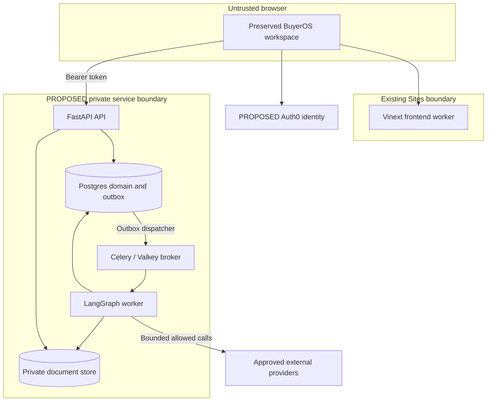

# Primary architecture and upstream reuse

Revision v1. Everything described as a new service, path or provider below is **PROPOSED**. No resource was created or connected. Read [00 decisions](00_README_AND_DECISIONS.md) and the [complete pinned reuse matrix](research/UPSTREAM_AUDIT.md).

## One primary architecture

Preserve **Vinext/React/TypeScript with the current App Router API, pnpm lockfile, Tailwind and existing workspace**. Keep the existing Sites/Cloudflare frontend deployment as the first hosting target. Add one external **FastAPI/Pydantic domain API**, one **Celery worker service with LangGraph**, one **Valkey durable broker**, and **PostgreSQL with Neon as the proposed managed host**. SQLAlchemy/Alembic owns BuyerOS domain migrations. Use managed **Auth0 OIDC with Authorization Code + PKCE**, subject to owner approval of tenant/issuer/audience. Use one private S3-compatible object store, **Cloudflare R2** (APAC jurisdiction), for permitted documents. Proposed API/worker host: **Render, Singapore**; database **Neon `ap-southeast-1` (Singapore)**. Staging uses default provider hostnames unless a later approved decision adds a domain. Separate process roles can share the same built Python image. Do not add a Node domain backend.

This is a concrete proposed stack, not a menu. BO-001 resolves named tenant/region/resource choices and measures compatibility. If those choices fail, write one ADR and revise dependent tasks before implementation; do not silently select a second queue, backend or IdP.

No personal/company data is stored in frontend worker memory as the system of record. The public demo remains reproducible and separate from the live workspace. Hosted frontend visibility does not authenticate a user to the external API. Secrets exist only in approved server secret stores.

## Stack provenance and ADRs

| ADR | Layer / decision | Provenance | Exact evidence / reason | Blocker / overturn condition |
|---|---|---|---|---|
| ADR-01 | Preserve Vinext 1.0.0-beta.5, Next App Router APIs, React19, pnpm11 | EXISTING_VERIFIED | `vite.config.ts`, `scripts/run-framework.mjs`, `app/layout.tsx`, `features/workspace.tsx` | Change only with an approved runtime incompatibility ADR |
| ADR-02 | Sites frontend initially; Render API and worker | Existing frontend + NEW_RECOMMENDATION for Python hosting | Cloudflare plugin is current; ordinary web requests cannot own long research jobs | B-HOST: region, persistent broker, service plan and staging boundary |
| ADR-03 | FastAPI only domain API | OWNER_DIRECTION / NEW_RECOMMENDATION | No existing BuyerOS API; typed Python graph and DB domain avoid duplicated business logic | Existing newly discovered backend must trigger replan |
| ADR-04 | SQLAlchemy/Alembic only domain migration owner | NEW_RECOMMENDATION | Empty `db/schema.ts`, SQLite `drizzle.config.ts`, empty journal; no domain data to migrate | BO-005 rechecks; if D1 gains data, inventory/export/roll-forward plan before any cutover |
| ADR-05 | Postgres system of record, proposed Neon managed option | OWNER_DIRECTION / NEW_RECOMMENDATION | Transactions, composite FKs, budget locks, durable events; no vector service required | B-HOST selected project/region/backups; no credentials presently verified |
| ADR-06 | Celery with one Valkey broker; DB outbox and job leases | NEW_RECOMMENDATION | Explicit durable dispatch and bounded Python worker nodes | BO-011 failure suite on chosen exact broker/client versions; no BullMQ/RQ/second queue |
| ADR-07 | Managed Auth0 OIDC, browser token to FastAPI; **public SPA client, Authorization Code + PKCE** | NEW_RECOMMENDATION / execution unresolved; app reconfiguration required | Unused Site header helper cannot authenticate external API. Owner-supplied tenant `dev-oaug20cdxqqgn1s8.us.auth0.com` is currently a `regular_web` client (`client_secret_post`, callback `localhost:3000`) and must be reconfigured to a public PKCE client with the Site origin registered | B-IDENTITY: app reconfiguration + membership owner; see `decisions/BO-001-runtime-identity.md` |
| ADR-08 | One private S3-compatible store, **Cloudflare R2 (APAC jurisdiction)** — revises the earlier AWS S3 proposal | Owner direction (revises NEW_RECOMMENDATION) | Existing Sites R2 binding is null and stays unused; the Render worker needs server-side controlled document access over the S3-compatible API | B-HOST: R2 account/jurisdiction, retention and object policy; see `decisions/BO-001-runtime-identity.md` |
| ADR-09 | Public-web discovery primary; selective AI_Find_Customer MIT adaptation | NEW_RECOMMENDATION based on inspected upstream | Active upstream search is Maps-only; preserve own evidence/tenant/ledger contract | BO-002 provider/dependency review; no upstream runtime installation |
| ADR-10 | BetterContact is the sole proposed business-email provider candidate, disabled until verified | PROPOSED, NOT CAPABILITY_VERIFIED | Actual OpenOutFind provider module exists; does not prove commercial API guarantees | B-PROVIDERS idempotency/status/charge bound/retention tests; no fallback waterfall |
| ADR-11 | One project-approved LLM provider and named task routes, selection/model identifiers blocked | UNRESOLVED_EXECUTION_GATE with one primary route per task | No actual BuyerOS LLM config exists; report acronym does not resolve provider/model | BO-002 must record exact current provider/model/version/output support and price; no invented model ID |
| ADR-12 | Research/contact/draft live pilot first; delivery separately approved | OWNER_DIRECTION / NEW_STAGING_RECOMMENDATION | User specifically separates real delivery; source disables Send | B-DELIVERY; P7 cannot auto-start |

For the public-web search adapter, **Tavily is the proposed first provider**, with website fetching through a BuyerOS safe-fetch boundary. Its exact endpoints, supported filters, price version and rights must be verified in BO-002; the plan does not invent an API request. The selection is not a claim that Tavily is available in the owner's account. AI_Find_Customer's Maps adapter is not a drop-in public-web search implementation. Search/evidence quality and spend ceilings decide whether this provider is acceptable before activation.

## Hosting and trust decisions

**Frontend preservation.** `RootLayout` mounts `Workspace` and does not render page children. `app/page.tsx` and `app/[...slug]/page.tsx` return null. Therefore initial integration stays in existing Workspace/feature boundaries, with proposed scoped hooks/client state modules. Do not write new route page components under an ignored child slot and call them integrated. Correct invalid-ID fallbacks and add durable deep-link loading within the existing router conventions. Keep CSS/approved assets/components intact while separating data ownership.

**Vercel alternative.** No Vercel deployment is verified. Current build includes Cloudflare-specific hooks/Worker artifacts; `next` in dependencies is not proof `next build` is a supported production path. Defer a Vercel port until a clean approved spike verifies the same routes, asset loading, authentication and build output without changing the visual product. This avoids making the first live pilot depend on a host migration.

**Identity.** Auth0's PKCE flow is suitable for public browser clients that cannot keep a client secret. Proposed implementation: SDK-managed verifier/state/nonce; access token in memory; API JWT signature/issuer/audience/expiry/algorithm validation; key rotation and short bounded JWKS caching. Membership/role/project authorization is independently looked up server-side on every operation. Token claims do not grant arbitrary tenant ownership. ID tokens are not accepted as API access tokens. Refresh/logout/session expiry and immediate membership removal are explicit tests. [Auth0 PKCE reference](https://auth0.com/docs/get-started/authentication-and-authorization-flow/authorization-code-flow-with-pkce).

Only exact approved frontend origins receive CORS access; no wildcard with credentials. Domain mutation endpoints require bearer authentication and JSON bodies. An OIDC browser SDK owns login CSRF controls. If later cookie sessions are chosen, CSRF/Origin defenses require a revised contract. Do not forward untrusted `oai-authenticated-user-*` headers to FastAPI. Reusing Sites identity would require an independently verified signed server exchange and membership contract; no such bridge was found, and none is assumed.

For SSE use authenticated fetch streaming with Authorization header, not credentials in query strings; resume from committed run sequence. Polling is the fallback. On token expiry stop display/stream, refresh through the approved identity flow, then replay durable events. Tenant switch aborts old requests and clears selections/quotes/editor caches. A late response must be rejected if its workspace/project context differs.

**Long workers.** Render background workers are designed for continuous tasks without inbound request handling. Proposed worker runs outside the web server request lifecycle. Keep API handlers short; `202` requires a durable DB commit. [Render worker documentation](https://render.com/docs/background-workers). Render deploys can terminate old workers; its shutdown behavior must be tested with SIGTERM and hard kill, not assumed to drain every paid call. Disable automatic live deployment until an approved release. Build/start/pre-deploy limits in docs are host limits, not research-job deadlines. [Render deployment reference](https://render.com/docs/deploys).

Proposed application limits, **not provider/host guarantees**: API non-streaming request target ≤15s, stream heartbeat 15s, one run at most 30 minutes wall clock under the authoritative limits in 03 §8.1, each fetch 15s, LLM step 45s, contact submit 20s. A timeout returns a known failed-safe state only when the operation provably never left the process. Otherwise status is unknown. The proposed global ceiling is four concurrent provider operations per run, with an initial per-provider semaphore of one; API/worker replica concurrency must preserve that shared ceiling. BO-001/002 approve actual limits. No SLA is promised.

**Database roles.** Separate migration owner, API role, worker role and checkpoint role. Runtime roles cannot own tables, bypass RLS or mutate schema. Tenant context uses transaction-local settings with composite workspace FKs and explicit query predicates. Use a pooled DSN for normal API transactions, a direct DSN for migrations/backup and compatible checkpoint access; verify pooled connection reuse and reset with non-owner roles. Never hold DB transactions open across external HTTP calls. Neon transaction pooling is documented; session assumptions must not cross pooled transactions. [Neon pooling](https://neon.com/docs/connect/connection-pooling).

**One migration owner.** Alembic owns the BuyerOS domain plus serialized release of any required checkpoint schema setup, in a separate schema. LangGraph checkpoint tables have library-defined compatibility requirements, but application startup must never auto-migrate. Pin package versions, review generated setup SQL in BO-005/011, run with the migration owner only under a future approved migration task. Empty Drizzle example files remain unused; they do not own the same tables. Browser/domain TS DTOs come from OpenAPI and never become an independent schema migration authority.

**Queue, checkpoints and state.** Celery/Valkey is the only task transport. Postgres holds command/outbox/job identity and monotonic event facts. Dispatcher retries publish, consumers deduplicate job IDs, and a recovery scan re-enqueues committed runnable jobs after lost broker data. This is not a second queue engine; it is the durable enqueue/recovery record. Acknowledgement follows committed work. Lease heartbeat plus a fencing generation prevents two workers committing the same step. Prefer short tasks; do not encode long business waits as broker countdown messages.

Redis-compatible Celery transport has a visibility timeout and can redeliver tasks; increasing that setting does not make provider side effects exactly once. Choose visibility longer than the largest bounded task and test worker/broker loss. [Celery transport caveats](https://docs.celeryq.dev/en/stable/getting-started/backends-and-brokers/redis.html). Render paid Key Value supports persistence; choose the persistent plan and non-evicting queue policy, then verify actual behavior. Free ephemeral storage is not the durability plan. [Render Key Value](https://render.com/docs/key-value).

LangGraph checkpoints preserve workflow state at a thread/checkpoint; business records, cost ledger and outbox remain distinct. Use server-generated job identity mapped to tenant/project/run/workflow revision. No checkpoint may authorize a paid request or bypass a newer policy decision. [LangGraph persistence](https://docs.langchain.com/oss/python/langgraph/persistence).

## Proposed research graph and bounded resources

Workflow state references IDs, hashes and counters, not unrestricted blobs or private reasoning: workspace/project/run, approved ICP revision, offer revision, provider-operation IDs, bounded query plan, candidate IDs, evidence IDs, remaining quota, cancellation version, output schema/prompt version and last committed sequence. Worker verifies tenancy from DB for every task; a queue payload's workspace field is not trusted alone.

1. Validate frozen offer/profile/limits and paid-provider capability readiness.
2. Generate bounded DE/NL/BE language queries: German for DE, Dutch for NL, Dutch/French as relevant for BE, English industrial vocabulary as approved fallback. Markets and languages come from the saved profile, not fixture equality checks.
3. Search at most 3 rounds with 12 query dispatches **total per logical run**, including safe retries, and 300 raw results, according to the authoritative proposed pilot limits in 03 §8.1. Reject unsupported filters explicitly. Search can cost money even without contact lookup.
4. Normalize URL/domain aliases and canonical company candidates. Retain separate legal entities on shared corporate domains; fuzzy duplicates await human review. Store raw→canonical mapping; no irreversible automatic fuzzy merge.
5. Fetch at most 200 page attempts per run with a 2 MiB decompressed/page cap (maximum 400 MiB before stricter storage/retention limits). Count retries against the same logical-run ceiling. The complete authoritative limit table is 03 §8.1. Follow ≤3 safe redirects, pin/check actual destination address each hop, block metadata/private/loopback/IPv6/link-local targets. Treat fetched text as untrusted input.
6. Apply deterministic hard exclusions and preserve contradictory evidence. Structured fit returns supported/contradicted/unknown requirements, evidence IDs, terse rationale and next review action. No model scratchpad/chain-of-thought storage.
7. Validate every cited evidence ID belongs to the same tenant/run/company scope and is permitted/current. An unsupported claim is removed or marks Needs review; model success never means evidence success.
8. Atomically persist immutable assessment, raw/canonical mapping and run events. Stop at quota, time or budget; keep partial results. Await human acceptance. There is no graph edge into contact enrichment or sending.

Prompts are proposed versioned assets per task (offer insight, query plan, fit, draft); each has strict schema, allowed tools, deterministic fixtures, tokens/output caps and at most one schema-repair attempt within its already approved budget. Prefer deterministic parsing before model calls. Cache only permitted source/query results within tenant and retention scope; no shared cross-customer private learning. Model escalation, if later allowed, gets a separate bounded reservation and evaluation comparison. Do not use vectors for deterministic company identity. No standalone vector service is planned.

A separate user-confirmed contact workflow and a separate budgeted draft workflow have independent task IDs and policies. Numeric limits above are proposed safety/product parameters for BO-002/013, not evidence of current vendor quotas or owner approval.

## Pinned upstream reuse decision

The [component-level matrix](research/UPSTREAM_AUDIT.md) is normative for exact symbols, interface observations, component/dependency license considerations, required tests, risks and copy/defer decisions. It is part of this document by reference; do not replace it with README-level assertions.

| Upstream | Pinned commit | Inspected role | Primary decision |
|---|---|---|---|
| xiongQvQ/AI_Find_Customer | `9b2fde8f719623c627516da2663707a893ee6805` | MIT insight/query/graph/extraction/draft code, local API/state | Selective adaptation after exact copied-file/dependency approval; rewrite tenant, queue, financial and evidence guards |
| eracle/OpenOutreach | `b8bb2e36c0b30ff885bd5899d43b27bdad7ee3bd` | GPL orchestration over finder/sender, shared Django configuration | Defer; default runtime can migrate, pay and send |
| eracle/OpenOutFind | `9ae6804b9e742599f5a747b7b55173847c20cb71` | GPL finder, fit ranking, enrichment, outbound JSONL | Optional later adapter; no arbitrary inbound company interface assumed |
| eracle/OpenOutSend | `38e0051997a61412934e93eb15da97179bf98f47` | Separately MIT JSONL ingest and sender | Defer to P7; ingest schema does not contain BuyerOS approval proof |
| eracle/OpenOutLearn | `93403d583f3098dda06e9684e95ef98f93674187` | GPL ranking dependency; metadata/license inspection only | Defer advanced ranking; implementation not fully audited |

Source-specific deviations that matter:

- `AI_Find_Customer/backend/agents/search_agent.py:search_node` routes to Maps at this pin. The README's broader channels are not the active interface.
- `backend/graph/evaluate.py:evaluate_progress` decides whether discovery continues. It is not the BuyerOS fit assessment.
- `backend/tools/email_verifier.py:EmailVerifierTool.verify` checks syntax/domain DNS, not mailbox validity. Never map that result to Provider-marked valid.
- Upstream API/SSE uses local/in-memory state and does not establish tenant isolation or durable event replay. Reimplement behind BuyerOS contracts.
- Finder's contact hub introduces external operator data exchange. Exclude it and deny egress to its service in pilot code/tests.
- Finder's usable catch-all handling and retryable uncertain submission are incompatible with BuyerOS. Preserve validity classification and unknown financial holds.
- A separate GPL process or JSONL channel is not a blanket commercial license solution. Each exact copied component and actual integration/distribution requires review. PyMuPDF-derived parsing dependencies need their own review despite MIT repository licensing. No GPL source is copied as a claimed clean-room implementation.

## Directory and ownership plan

Existing paths are listed exactly in 01. These new paths are **PROPOSED** only, subject to final task file ownership: `services/api/buyeros_api/` for the single FastAPI domain application; `services/api/alembic/` for serialized domain migrations; `services/worker/buyeros_worker/` for Celery/LangGraph execution; `services/generated/` for generated OpenAPI TS DTOs; `services/live/` for the browser live-adapter mapping to the preserved demo views; `tests/contracts/` for generated-boundary contract tests (these require a pinned JS test runner, which the repo does not yet have); feature-scoped query/controller modules alongside current `features/`; private fixture-only provider test modules. The task manifest owns final path naming. Preserve root pnpm standards for frontend; use uv for both proposed Python service projects, with `services/api/uv.lock` and `services/worker/uv.lock` frozen together under BO-003/011. The worker depends by local path on the single `buyeros-api` domain package and must not duplicate models or business rules. CI checks compatible shared dependency versions. Preserve pnpm for JavaScript.

The empty Drizzle example does not justify another domain backend; no Kubernetes, Keycloak, Kafka, GPU hosting, vector service, self-hosted observability cluster or broad model marketplace is needed. Those alternatives add ownership and operating work without a verified pilot requirement. Use structured redacted logs, request/run/provider-operation IDs, budget reconciliation metrics and existing lightweight monitoring; Langfuse is optional observability after data minimization review, never the financial source of truth.
