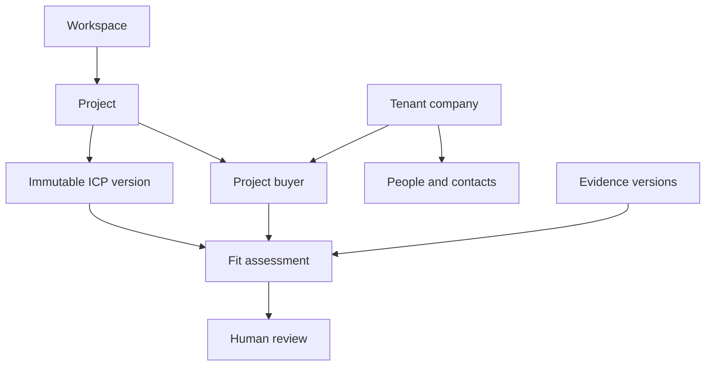
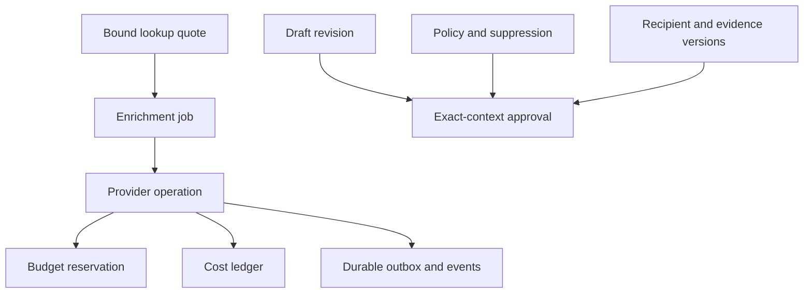

# BuyerOS data, API and state contracts

**Status: PROPOSED — PLAN ONLY.** Nothing in this document is an implemented API, schema, provider integration, migration or authorization to spend. Contract revision `v1`, prepared 2026-09-15. Implementation tasks remain unexecuted. Read [decisions](00_README_AND_DECISIONS.md), [source audit](01_SOURCE_AND_UI_AUDIT.md), [architecture](02_ARCHITECTURE_AND_REUSE.md), and [proposed OpenAPI](contracts/openapi.proposed.yaml) together.

## 1. Evidence and the integration boundary

The inspected BuyerOS tree is the exact saved Site export; the parent audit records the GitHub/Sites tree comparison and commits. Source evidence for this document is `services/contracts.ts`, `services/http-client.ts`, `services/mock-client.ts`, `services/run-engine.ts`, `features/workspace.tsx`, `features/discovery/wizard.tsx:Wizard`, and `features/buyers/detail.tsx:BuyerDetail`. These are **SOURCE_VERIFIED** paths. GitHub base: `b804ba8d1514a1049b7202c861278dd72c473a75`; equivalent saved Site source commit: `76892126c86031bfe8e7ab517adba7f306040313`. Browser behavior is classified separately in 01.

<a id="demo-live"></a>

`BuyerDiscoveryClient` in `services/contracts.ts` labels itself a proposed integration boundary. It is not an HTTP implementation. `services/http-client.ts` reexports the mock module; `httpClient.request` in `services/mock-client.ts` throws `NOT_CONFIGURED`. `Company` currently combines company identity, project fit, human review, contact label, policy, suppression, notes and evidence. `RecordBase.dataMode` is the literal `demo`; quote and cost fields are JavaScript numbers. The implementation must adapt these contracts deliberately rather than treating their current types as a production data model.

The master was read completely. The separately found earlier frontend specification was also read completely. Its desired behavior is a requirement source, not proof of implementation. The requested research, Site projection and source-register reference files were not supplied in the available pack; full source-conflict reconciliation is therefore blocked as recorded in 00. No source-only decision below relies on the absent report.

| Inspected current symbol | Verified current semantics | Required live contract decision | Task |
|---|---|---|---|
| `BuyerDiscoveryClient.createProject/updateProject/saveICPVersion` | Type declarations; local wizard stores current offer, not durable project/profile versions | Project IDs, immutable profile content and explicit server approval | BO-003, BO-007 |
| `Workspace.startRun`; `advanceRun/cancelRun/retryRun` | Timer-driven synthetic counts and simulated costs; retry changes local run state | Durable run and committed events; restartable bounded worker; no demo timers in live mode | BO-011, BO-016 |
| `Workspace.rows/buyerTable` | Client filters, sort, offset slices and select-all over local array | Server snapshot with stable ordered buyer IDs, explicit selection scope, per-row versions | BO-008 |
| `Workspace.reviewed/update` | Local acceptance and notes/owner; review mutation increments related draft revisions | Separate immutable review event, buyer version, author membership; precise invalidation | BO-008, BO-022 |
| `mock-client.block/quote/confirm/usage` | Local gates; dialog creates `Reserved`; time-expiry drops local reservation; simulated contact result | Quote before reservation; confirmation atomically reserves; uncertain dispatched operations retain holds | BO-009, BO-010, BO-017–020 |
| `BuyerDetail` | Overview/Evidence/Contacts/Activity; synthetic `.example` address; suppression also appears as contact status | Keep four tabs; return independent contact validity, suppression and purpose policy | BO-008, BO-014, BO-020 |
| `Workspace.editDraft`; local approval handler | Browser revision and checklist; user-entered text; no durable evidence/recipient/policy binding | Immutable revision plus server-computed content/context hashes; approval exact-context binding | BO-021–022 |
| `mock-client.csv/download`; `Workspace` list/export actions | Actual local synthetic file export and in-memory membership | Scoped audited real-data export; formula defense; copy/export do not mean sent | BO-023 |
| `usage`; Results/Settings in `Workspace` | Local numerical event sums, fictional outcomes, local budget edits | Decimal ledger, period-defined real metrics, budget-admin authority, manual outcome provenance | BO-010, BO-024 |

Preserve the Vinext App Router route layout, React/TypeScript, existing source filenames, pnpm lockfile, drawer/tabs, table density, mobile cards and English/zh-HK. Add a typed adapter behind the existing feature boundary. **PROPOSED new implementation targets:** `services/api/buyeros_api/`, `services/api/alembic/`, `services/worker/buyeros_worker/`, and `services/generated/`. These paths do not exist merely because this plan names them. Alembic is the only owner of new BuyerOS domain schema. Do not migrate these tables through the current empty Drizzle SQLite scaffold.

## 2. Domain invariants

| ID | Invariant | Failure must be observable |
|---|---|---|
| INV-TENANT | Identity claims verify a caller; current server membership authorizes each workspace and project. Company research is tenant-local. | Foreign IDs produce tenant-safe denial; no row, file, event or count leaks. |
| INV-ACCOUNT | A canonical company, project buyer, person, contact, fit assessment and review are distinct. | Three contacts at one company remain one company. |
| INV-EVIDENCE | Fit and generated factual claims reference retrievable permitted evidence or approved offer facts; unknowns/inferences are labelled. | Unsupported claims do not receive approval. |
| INV-PROFILE | Saved ICP content is immutable; approved version is explicit. | New offer/profile versions cannot rewrite historical evidence or reviews. |
| INV-POLICY | Fit, human review, validity, suppression, contact research permission and outreach permission are independent. | Valid email plus accepted buyer cannot bypass unknown outreach policy. |
| INV-BUDGET | Before every billable operation, all applicable scope limits hold atomically using fixed precision. | No new external dispatch after budget rejection. |
| INV-UNKNOWN | External submission uncertainty retains the unspent reservation bound until authoritative reconciliation. | Timeout, quote expiry, UI closure, worker crash and cancel do not silently release money. |
| INV-APPROVAL | Approval binds exact content revision, recipient, sender, ICP/evidence and policy context. | Any material change invalidates it before export/any later delivery. |
| INV-DURABLE | Job intent, outbox record, state transition and event commit together. Queue/checkpoints are not business truth. | Accepted jobs survive worker/API/broker restart and do not double-settle. |
| INV-DEMO | Live adapter never imports demo rows or falls back to fixtures on error. | Failed API displays real error/empty state; `data_mode=live` never labels synthetic rows. |
| INV-DELIVERY | MVP-A delivery is disabled at server boundary. | Approved/copied/exported draft never becomes sent. Manual outcomes say manual. |

The report's generic campaign/lead terminology maps to `projects`/`project_buyers` when describing research. An email campaign or sequence is a separate later domain, absent from MVP-A.

<a id="data-model"></a>

## 3. Schema proposal and migration ownership

All tables below are **PROPOSED**. Default PK is UUID, with server-generated UTC `created_at`, `updated_at` and positive integer `version` where mutable. For the pilot, `controller_scope_id` must equal the controller scope approved in that workspace configuration; it cannot name another customer or confer cross-workspace privileges. Every tenant-owned table has non-null `workspace_id` and `UNIQUE(workspace_id,id)` so composite foreign keys can prevent tenant crossing. IDs are opaque; clients cannot create actor IDs, timestamps, states, settled costs or approval hashes by patching arbitrary fields.

### 3.1 Relationship diagrams





The diagrams summarize key relationships; the table below is the complete proposed entity inventory and constraint guide.

### 3.2 Tables, keys, relationships and indexes

| Table / owner | Core fields and relationship | Constraints and useful indexes | Retention / deletion |
|---|---|---|---|
| `workspaces` | Name, controller scope, billing currency, lifecycle state | Unique workspace ID; `data_mode=live` for live DB | Archive requires cancellation/reconciliation; deletion is approved workflow |
| `users` | Verified OIDC `issuer`, `subject`; minimal display fields | Unique `(issuer,subject)`; no password storage | Remove profile PII under policy; preserve pseudonymous audit key where required |
| `memberships` | Workspace/user, role set, active/revoked, permissions version | Unique `(workspace_id,user_id)`; active membership query index | Revoke immediately; no reliance on stale JWT roles |
| `projects` | Workspace, name, seller/company, current offer revision, markets, active ICP, archived | `(workspace_id,status,updated_at,id)`; composite active ICP FK constrained to project | Archive; preserve historical assessment context |
| `offer_documents` | Project, private object key, SHA-256, MIME, parser status, retention expiry | Unique `(workspace_id,project_id,sha256)` where appropriate; object key not public | Quarantine first; delete object and invalidate dependent facts/evidence |
| `icp_versions` | Project, monotonic number, immutable JSON requirements/offer facts with stable fact IDs, content hash, parent, approver/time | Unique `(workspace_id,project_id,number)`; content immutable; profile approval row lock | Historic permitted content retained by project policy; sensitive fields redacted with tombstone |
| `search_runs` | Project, approved ICP, limits, stage/status/attempt, ceilings, count fields, terminal reason | `(workspace_id,project_id,created_at,id)`; active status index; version compare | Partial results retained independently; lifecycle TTL configurable |
| `run_events` | Run, monotonic sequence, event ID, type, counts, committed run version, minimal payload | Unique `(workspace_id,run_id,sequence)` and event ID; cursor index | Proposed 30-day replay window, policy configurable; expired cursor explicitly refreshes |
| `raw_candidates` | Run/query/provider operation, normalized source URL, external reference, raw digest, canonical company candidate | Unique provider operation/external reference or normalized URL; no permanent raw HTML by default | Short source-specific TTL; no automatic storage of scraped personal data |
| `companies` | Tenant-local legal/display name, jurisdiction/registry identifiers, reviewed aliases, identity status | Registry identity unique when trustworthy; **domain index is non-unique**; no unique domain shortcut | No cross-tenant research sharing; merge has audit and reversible aliases |
| `company_aliases` | Company, type/domain/URL/registry alias, provenance/confidence, reviewed status | `(workspace_id,alias_type,normalized_value)` non-unique until disambiguated | Keep canonicalization lineage; no private data federation |
| `project_buyers` | Project/company pair, owner membership, note, latest effective fit/review pointers, version | Unique `(workspace_id,project_id,company_id)`; `(workspace_id,project_id,fit_rank,name_sort,id)`; reviewer/filter indexes | Lists and evidence survive membership removal; buyer archive is separate |
| `people` | Company, permitted role/name, provenance and policy/retention | Tenant/company composite FK; no speculative unique person by name | Personal-data policy expiry/deletion cascades to contact visibility |
| `contact_points` | Company/person optional, normalized business email, provider validity, checked_at, source operation, retention, quarantine state | Unique appropriate `(workspace_id,company_id,type,normalized_value)`; indexed hashed exact-match key for suppression | Value encrypted at rest; mask/redact on policy expiry; validity never equals suppression |
| `source_documents` | Source URL/provider ref, normalized canonical URL, digest, retrieval/observation time, original language, permitted storage mode, object ref optional | `(workspace_id,canonical_url,retrieved_at)`; hash index; duplicate bodies can share tenant-local permitted object | Policy/source-specific TTL, no promise of permanent snapshots |
| `evidence` | Project/company/source, requirement ID, version, excerpt, translation labelled separately, supports/contradicts/qualifies, observation/inference | `(workspace_id,project_id,company_id)`; source+version FK; requirement belongs to bound ICP | Expiry/deletion marks evidence unavailable and invalidates dependent contexts |
| `fit_assessments` | Project buyer, ICP version, evidence-set hash, verdict/rationale, supported/contradictory/unknowns, prompt/model route | Immutable assessment; unique deterministic assessment input hash per algorithm version; buyer/time index | Store explanation and evidence IDs, never private chain-of-thought |
| `human_reviews` | Buyer, fit assessment+ICP reviewed, actor, state/reason/time, prior review | Append-only; latest review index; rejected/needs-information requires reason | Historical accepted status remains, but stale basis blocks effective eligibility |
| `buyer_lists` / `list_memberships` | Named project list; list/buyer relationship | Unique `(workspace_id,list_id,buyer_id)`; composite project scope; list version on rename/bulk change | Remove relationship only; never delete company/evidence |
| `filter_presets` | Actor/project, name, normalized filter schema/sort | `(workspace_id,actor_id,project_id,name)`; semantic schema version | User preference; no stored contact values |
| `buyer_snapshots` / `buyer_snapshot_items` | Actor/project/filter hash/sort/expiry; ordered buyer ID+expected version | Unique snapshot ordinal and buyer; `(workspace_id,snapshot_id,ordinal)` | Proposed 15-minute TTL; delete ephemeral rows; cannot outlive authorization |
| `enrichment_quotes` | Actor/project, purpose, eligible/blocked sets, request/quote hashes, profile/review/policy versions, roles, price/adapter version, max USD/credits, expiry | Immutable quote payload; one consumption `consumed_job_id`; quoted→consumed/expired/cancelled | Quote expiry only ends authorization to start; never releases submitted-job holds |
| `enrichment_jobs` | Quote, state, cancel flag, reservation group, counts, reconciliation state | Unique `(workspace_id,quote_id)`; active job/lease queries | Keep lineage to all provider operations; delete result PII per policy, not cost evidence |
| `provider_operations` | Stable intent key, capability/adapter/prompt version, input hash, provider idempotency key/ref, status, deadline, cancel flag, pricing snapshot | Unique `(workspace_id,intent_key)`; unique provider/reference when present; index unknown/pending; write intent before call | Store redacted response digest/minimal reconciliation fields; personal payload short TTL |
| `provider_events` | Provider/account/event ID, raw signature verification metadata/digest, provider sequence, operation FK, processing state | Unique `(provider,account_reference,event_id)`; digest conflict quarantines replay | Retain verified replay metadata by provider/policy; no unbounded webhook body logs |
| `budget_accounts` | Scope workspace/project/run/category, currency, period, approved limit, settled/reserved projections, version | Unique scope/currency/period; check nonnegative; locking all relevant accounts in stable ID order | Keep financial records per approved retention, separate from research payload |
| `budget_reservations` / `reservation_allocations` | Operation or bounded batch reservation group, upper bound, remaining hold, state; applicable account projections | Unique operation reservation key; each account allocation unique; cannot double-count allocations as economic spend | Holds persist through unknown; closed balance reconstructible from events |
| `cost_events` | Economic event ID, operation, kind reserve/commit/release/reconcile/reversal, USD decimal, credit amount separately, pricing version, happened/recorded timestamps | Append-only; unique provider charge/ref+event kind or operation settlement revision; no float; `(workspace_id,project_id,occurred_at,category)` | Reversal is new event; do not edit old settled amount |
| `sender_identity_versions` | Project-owned immutable display name, role, organization, business email, country, generated version key, reviewer/time and retired state | Unique `(workspace_id,project_id,version_key)`; active pointer on project; only reviewer/admin may create approved replacement via project PATCH | Human-reviewed preparation context, not mailbox ownership; replacement invalidates sender-bound approvals |
| `outreach_drafts` / `draft_revisions` | Buyer, current revision pointer/state; immutable recipient/sender/content/objective/tone/language/follow-up and evidence/offer references | Unique `(workspace_id,draft_id,revision_number)`; content and context hashes server computed; buyer/project composite FK | PII expiration/redaction invalidates approvals; preserve digest and permitted audit |
| `approvals` | Exact revision/content/context/recipient version/ICP/evidence hash/policy IDs/sender, approver/time, validity/invalidation | Unique approval intent key; explicit invalidation reason; never delete approval to conceal history | Audit retained with minimized personal data; invalidated is not reusable |
| `suppressions` | Controller/workspace/project purpose scope, company/contact/domain key, reason/source, active/expiry, reviewer/removal reason | Subject/purpose active index; cryptographic contact hash for exact recheck; every scope tenant-safe | Retain minimum needed to honor suppression; removal is audited, never auto-permission |
| `policy_decisions` | Subject/controller/country context, purpose, status, basis/version/author, review expiry/retention, supersedes | Immutable decisions; current decision lookup `(workspace_id,subject,purpose)`; most restrictive applicable rule wins | Expiry returns effective unknown; trigger invalidation/reconciliation visibility checks |
| `outcome_events` | Buyer, manual source, stage, actor, occurred_at/recorded_at, notes/provenance, correction link | Append-only; logical outcome chain prevents double-counted corrections | Manual provenance preserved; no invented sender/inbox events |
| `audit_events` | Actor/request/event IDs, subject action, reason, hashes/state deltas without payload PII | Append-only; workspace/time/subject indexes; immutability enforced by DB role | Approved retention and controlled access; no access tokens/prompts/contact bodies |
| `idempotency_records` | Workspace/actor/operation/key, canonical request hash, status/response pointer, resource ID | Unique full scope; key conflict has 409; acquire before expensive operation | Proposed API replay retention ≥7 days; paid operation identity retained as long as reconciliation |
| `outbox_events` / `worker_leases` | Business intent, deterministic task ID, dispatch attempts/lease, durable completion state | Unique intent/type; ready/lease-expiry index; DB sweeper re-enqueues abandoned tasks | Queue acknowledgement is not durable business completion |
| `async_jobs` / `export_jobs` | Project/job kind/state/result reference; export scope/revision/expiry, immutable selection and redaction summary | Job/outbox atomic; private download verifies policy afresh | Proposed export TTL 15 minutes; revoke/delete on policy/suppression change |
| `langgraph_checkpoints` (and saver-specific companion tables) | Tenant/run/workflow/attempt/node checkpoint IDs, validated state references | Exact native saver schema is a BO-011 compatibility gate; pin saver version; scoped checkpoint key | No hidden chain-of-thought; minimize content and personal data; compatible retention/delete |

<a id="canonicalization"></a>

Canonicalization normalizes URLs with a real URL parser, lowercases/IDNA-normalizes hostname, removes default ports and tracking fragments, and records redirect/alias provenance. Public-suffix registrable domains are hints, not legal identity. Merge only proven identical registry IDs or a reviewed exact alias with compatible legal entity/market; shared brand domains, subsidiaries and similarly named distributors remain separate. Ambiguity produces a review item. Maintain reversible raw-candidate→company lineage and test alias merges, shared-domain subsidiaries, IDNs, moved sites and fixtures showing 26 raw candidates→24 companies without claiming these synthetic counts prove live accuracy.

### 3.3 Tenant-safe database rules

1. Relationships use `(workspace_id,parent_id)` foreign keys. Project-bound cross-links additionally prove common project with unique `(workspace_id,project_id,id)` keys, including buyer↔list, buyer↔assessment, ICP↔run, evidence↔assessment and draft↔buyer. `people`/contacts are tenant-company scoped; policy authorization adds project/controller purpose before exposure.
2. FastAPI uses a non-owner role without `BYPASSRLS`. Set tenant context through `SET LOCAL` inside each transaction; missing context fails closed. Use `FORCE ROW LEVEL SECURITY` where applicable. Migrations have a distinct owner role unavailable to API/worker runtime. Never count on RLS with superuser/table-owner credentials.
3. Worker task messages contain opaque IDs, workspace ID and operation token, never bearer tokens or contact payloads. Load operation from DB, verify workspace and current authorized scope, then set the same transaction-local tenant context. Cross-tenant owner and pool reuse tests are mandatory.
4. Integration uses transaction pooling-compatible SQL and explicit transaction scope. No session-level tenant variable persists through a reused connection. `icp_versions`/financial/approval writes are serialized where shared.
5. Alembic owns domain DDL. LangGraph saver setup may create its own tables only through a pinned reviewed bootstrap migration/setup phase under the migration owner; runtime graph initialization cannot run `.setup()` DDL with API credentials. Do not let two migration systems race over the same schema.
6. Local demo remains in existing synthetic store and keys. Do not import `data/demo/fixtures.ts` into migrations, production seed logic, API, worker, live fallback or a tenant database.

<a id="authentication"></a>

## 4. HTTP, identity and error contract

The [OpenAPI](contracts/openapi.proposed.yaml) declares 70 **PROPOSED** operations with 139 named schemas, typed envelopes, per-operation tenant/role, policy, cost, idempotency and version annotations. Its server `https://api.buyeros.invalid` is deliberately non-routable. It is not a deployment target. Endpoint examples are synthetic contract illustrations, not evidence of service availability.

Primary identity proposal: managed Auth0 OIDC Authorization Code + PKCE in the preserved frontend, browser-held short-lived access token in memory, direct bearer calls to FastAPI. Issuer, audience, token claims, membership/organization mapping, callback URL, logout/revocation and allowed origins are **BLOCKED** by BO-001. Do not activate guessed Auth0 configuration. Backend verifies cryptographic signature and current issuer/audience/expiry/algorithm; server DB membership defines authority. No provider, database or client-secret values in browser code. CORS allows only approved origins, never wildcard with credentials. Bearer-only API does not accept ambient cookies as authority. If an existing auth/session scheme is discovered, stop and revise the ADR rather than layering a second login.

Routes preserve existing page paths; API context is explicit: `/v1/workspaces/{workspace_id}/projects/{project_id}/...`. There is no assumed Node domain BFF. Client adapter converts current display labels (`Match`, `Accepted`) to stable API enums without conflating dimensions. All live successful JSON envelopes carry `{data, request_id, data_mode:"live"}`. Errors carry stable code, message, request ID and retryability; no live response contains demo fallback data.

| Status / code | Meaning and safe recovery |
|---|---|
| 202 | Job and outbox committed. Show queued/status link; never show completed lookup/research. |
| 400/422 `INVALID_REQUEST` | Malformed/unknown field or semantic invalidity; repair input, no external effect. |
| 401 `UNAUTHENTICATED` | Reauthenticate; clear sensitive cached state on session loss. |
| 403 `PERMISSION_DENIED`, `POLICY_UNKNOWN`, `POLICY_BLOCKED`, `SUPPRESSED` | Stop action, explain reviewed prerequisite. No automatic bypass/retry. |
| 404 `NOT_FOUND` | Missing or foreign-tenant resource; no existence disclosure. |
| 409 `IDEMPOTENCY_CONFLICT`, `QUOTE_CHANGED`, `QUOTE_EXPIRED`, `SELECTION_EXPIRED` | Reload/requote/reselect; never silently change selected rows or price. |
| 412 `STALE_REVISION` | Another actor/context changed; refresh and ask user to review current data. |
| 409 `BUDGET_LIMIT` | No reservation/dispatch; lower scope or authorized budget review. |
| 409 `PROVIDER_SUBMISSION_UNKNOWN` | Existing submission may be accepted; hold funds and reconcile. Never create new paid call on browser retry. |
| 503 `PROVIDER_UNAVAILABLE`, `PROVIDER_CAPABILITY_BLOCKED` | Show real provider unavailability; preserve partial results/holds; no fixture substitution. |
| 409 `EVIDENCE_STALE`, `APPROVAL_STALE` | Refresh relevant evidence/context and request new approval. |
| 200 bulk result with blocked/conflict items | Explicit partial mutation outcome; UI displays per-row result and current eligible selection. |
| 403 `DELIVERY_DISABLED` | Expected for MVP-A delivery boundary, even with a valid draft approval. |
| 429 `RATE_LIMITED` | Retry according to server delay within safe idempotent scope; no speculative duplicate paid submission. |

Every mutation except provider callback requires a non-PII `Idempotency-Key`. Its scope is `(workspace,actor,operationId,key)`, with canonical body hash including selected versions. Same key/body returns the original result, even if the browser timed out; changed body is 409. Read operations do not create paid work. `If-Match: "4"` is required on versioned edits; bulk commands use per-item expected versions. Server timestamps, IDs, actor, price and approval hashes are authoritative.

The normalized callback schema and placeholder `X-Provider-Signature` are **PROPOSED ADAPTER CONTRACTS, NOT VERIFIED VENDOR API**. BO-002 must inspect actual signed webhook/status/idempotency/cost semantics and replace these placeholders before activation. The handler verifies raw vendor bytes first, then transforms to the internal event schema. A vendor must not be configured to send our invented normalized payload. Callback tenancy is resolved from known operation identity; caller-supplied workspace IDs are forbidden.

## 5. API action inventory and examples

Complete schemas and operation annotations are in OpenAPI; this table is the implementation grouping, not a replacement for 01's source/UI matrix.

| Live capability | Proposed operations | State and integration |
|---|---|---|
| Navigation/project selection/preferences | `listWorkspaces`, project CRUD, `getPreferences/updatePreferences` | Empty live workspace stays empty; missing deep-link ID shows 404, never selects HarbourSense. BO-004/007/025 |
| Offer and approved profile | `uploadOfferDocument`, `ingestOfferUrl`, `get/deleteOfferDocument`, `list/save/approveICPVersion` | Untrusted document→quarantine→parsed candidate facts→human-approved immutable ICP. BO-007/012 |
| Search/progress | `list/start/get/cancel/retryRun`, `getRunEvents`, `getAsyncJob` | Bounded tasks, durable event cursor, polling fallback and budget pause. BO-011/013–016 |
| Results and selection | `createBuyerSnapshot`, `listBuyers`, `getBuyer`, `listBuyerEvidence`, `getEvidence` | Stable snapshot/offset, current access redaction, exact evidence support. BO-008/014 |
| Review/notes/owners/lists/presets | `reviewBuyers`, `updateBuyer`, list CRUD/memberships, filter presets | Append review history; owner must be active project member; list duplicate no-op. BO-008 |
| Optional contact research | quote/read/cancel quote, confirm, job/read/cancel/reconcile, provider callback | User sees eligible/blocked quote, confirms atomic hold and job; no silent paid enrichment. BO-017–020 |
| Policy/suppression/settings | list/write policy, add/remove suppression, budgets, capabilities | Separate purpose decisions and validity; budget limit change is authorized server mutation. BO-009/010 |
| Draft editor | list/generate/get/edit/review/approve draft | Objective, tone, language, approved value proposition and optional follow-up; exact revisions. BO-021/022 |
| CSV, copy and download | buyer export, draft export, export status and authorized content | Audited scope; formula defense; recheck approval/policy at download. BO-023 |
| Results/usage | usage, list/manual outcome and correction, administrative audit | Distinct-company denominators, manual provenance and append-only corrections. BO-024/026 |
| Health and release | liveness, readiness, capabilities, disabled delivery | No secret exposure; ready is actual configuration/health, not decorative label. BO-028/030 |

<a id="profiles"></a>

### Profile persistence and approval

Project/offer edits persist a new pending profile version. Saved ICP content is immutable: edits create a successor with stable requirement/offer-fact IDs and content hash. A reviewer approves the exact hash and server version; source documents remain unapproved inputs until then. Active profile changes mark old review/fit bases stale for future guarded actions while preserving their history. No run may substitute the latest unapproved profile for its bound approved version.

<a id="enrichment"></a>

### 5.1 Review and lookup example

All IDs below are illustrative UUIDs; values are contract examples only. Send the actual access token as bearer authorization and a fresh scoped key. First save/approve the real ICP and persist/review the buyer.

```http
POST /v1/workspaces/10000000-0000-4000-8000-000000000001/projects/20000000-0000-4000-8000-000000000001/enrichment-quotes
Idempotency-Key: quote-review-example-01
Content-Type: application/json

{
  "selection": {"kind":"explicit","buyers":[{"id":"30000000-0000-4000-8000-000000000001","version":4}]},
  "purpose":"contact_research",
  "roles":["Procurement manager"],
  "contact_type":"business_email"
}
```

Nonzero figures in contract examples illustrate a state reached **after** explicit budget-admin approval. Initial project/category accounts have `USD 0.000000`; sample quote prices or run ceilings do not themselves authorize spend.

The proposed response contains an immutable quote hash, per-buyer eligibility and reasons, selected roles, actor/workspace/project, provider adapter/pricing version, decimal `max_cost`, and server expiry. `status="quoted"`, `reservation_id=null`, `consumed_job_id=null`. `expired` and unconsumed `cancelled` quotes also have both pointers null; only `consumed` has a reservation and job. Workspace administrators cannot confirm another operator’s quote: they must request a fresh quote bound to their own identity. The UI says “Quote expires …” and “Maximum cost”; it must not claim money is reserved on dialog open as the current demo does. If only some selected buyers qualify, list skipped IDs/reasons and require explicit confirmation of the eligible subset.

```http
POST /v1/workspaces/10000000-0000-4000-8000-000000000001/enrichment-quotes/80000000-0000-4000-8000-000000000001/confirm
Idempotency-Key: confirm-review-example-01
Content-Type: application/json

{"quote_hash":"aaaaaaaaaaaaaaaaaaaaaaaaaaaaaaaaaaaaaaaaaaaaaaaaaaaaaaaaaaaaaaaa","confirm_eligible_only":true}
```

202 returns a **reserved, durably queued job**, not an address. If submission later times out, GET job shows `status="unknown"`, nonzero `held_cost`, and `reconciliation_state="pending"`. UI exposes status/reconciliation, not a second “buy” call. Quoted pricing is a verified server-side price snapshot, never the `.30` demo assumption.

<a id="selection"></a>

### 5.2 Snapshot and bulk behavior

1. Normalize filters and sort; create a server snapshot with actor/workspace/project/filter hash, maximum 1,000 IDs and 15-minute proposed expiry. Materialize `(ordinal,buyer_id,buyer_version)`. Snapshot creation is an authorized read-planning mutation, not a paid operation.
2. Return pages using `snapshot_id`, `offset`, `limit` to preserve current 8/12/24-row controls. Stable sort keys are `fit_rank,name_sort,buyer_id` or `name_sort,buyer_id`; ID breaks ties. A new run result cannot shift an existing page. Current access checks may redact/remove inaccessible data; show explicit changed-access state.
3. “Select this page” sends explicit versioned IDs. “Select all filtered” uses the snapshot ID and explicit excluded IDs. Server refuses a different actor/project/filter scope or expired snapshot. Display total bounded selection, not only visible rows.
4. Filters or locale-sensitive sort changes create a new snapshot and clear selection; locale affects labels, not identity. Stable server collation is documented; no client/server sort mismatch.
5. Mutation resolves the frozen IDs, then rechecks each entity under locks. Reviews/lists return individual updated/unchanged/blocked/conflict outcomes. Contact confirmation is stricter: a changed eligible set/price/context invalidates the quote; it never quietly charges for a new subset.
6. Export follows frozen scope, current privacy gates and explicit excluded counts. Do not treat snapshot membership as persistent permission to read contacts.

<a id="policy"></a>

## 6. Independent state machines

| Dimension | Allowed transitions / actor | Guards and side effects |
|---|---|---|
| AI fit | New immutable assessment: `match`, `needs_review`, `not_a_match`; worker generates only | Bound to approved ICP, source evidence versions and validator. No probability-of-purchase semantics. Stale evidence/profile marks freshness stale; do not rewrite prior verdict. |
| Human review | `awaiting_review → accepted/rejected/needs_information`; reviewer may append a later reversal after evidence review | Record actor/reason and assessment/ICP reviewed. Accepted historical record remains separate from effective current eligibility. Stale basis requires renewed review. Changes invalidate applicable approvals. |
| Contact research | Buyer `not_researched → in_progress → completed/unavailable`; a new permitted research cycle is explicit | Actual points have independent `unverified_public/provider_marked_valid/catch_all/unavailable`, provenance and checked_at. No point is fabricated when unresearched. |
| Suppression | `inactive → active → inactive` by authorized reviewer with reason; expiry policy may change effective state | Scope/purpose explicit; adding invalidates approvals and stops unsubmitted operations; removing does not restore old approval or alter validity. |
| Purpose policy | Effective `unknown/requires_review/permitted/blocked`; immutable authorized human decision supersedes previous | Most restrictive applicable controller/workspace/project/contact rule wins. Expiry/revocation returns unknown/blocked and invalidates affected permissions. Contact research permission does not grant outreach. |
| Run | `draft→queued→running→completed/partial/paused_budget/failed`; active→`cancel_requested→cancelled`; eligible terminal→queued on explicit retry | Preserve partial records and economic operations. New calls require admission; pending unknown provider work cannot be blind-retried. Terminal state committed with final counts/events. |
| Quote | `quoted→consumed/expired/cancelled` | Quote itself holds no money. Confirmation consumes once and creates reservation/job. Quote expiry after consumption does not release hold. |
| Enrichment job | `reserved→submitting→pending→found/not_found/failed`; uncertain→`unknown→reconciled`; pre-dispatch cancellation→cancelled | Composite result counts retain per-operation states. `cancel_requested` is independent because pending/unknown may persist. `failed` does not itself prove no charge; reconciliation state/hold determine closure. |
| Provider operation | `intent→reserved→submitting→accepted/pending→succeeded/not_found/failed`; uncertain transport→unknown; terminal financially reconciled | Persist intent before network; prohibit state regression from late/out-of-order events. A result and financial settlement can arrive separately. |
| Draft | `draft→review_requested→approved`; edits→draft with new revision; context change→stale; fresh reviewed revision may be approved | Author cannot set approved by PATCH. Invalidating approval is transactionally coupled to material change; historic record remains. |
| Delivery | Constant disabled capability in MVP-A | A draft has no Sent state. Delivery endpoint always rejects; no graph edge, worker task or mailbox adapter enabled. |
| Outcome | Immutable manual event; correction appends superseding event | Manual reply/meeting/opportunity is not measured inbox synchronization and is not inferred from copy/export. |

<a id="drafts"></a>

<a id="approval"></a>

### Approval transaction and invalidation

Canonicalize subject/body line endings for hashing without semantically modifying approved text. Hash a versioned canonical JSON object; specify serializer/version during BO-003 so Python and TypeScript agree. Store both exact displayed text and canonical hash inputs. Approval binds:

- draft ID, immutable revision ID/number and content hash;
- project buyer, reviewed assessment and approved ICP version;
- recipient contact ID, exact normalized recipient value hash and contact version;
- sender identity/version, objective, tone, language, initial/follow-up relation and approved offer-fact IDs;
- ordered canonical evidence ID/version set and hash, policy decision IDs/versions/context hash;
- current relevant suppression epoch, membership/approver identity and timestamp.

Lock draft/current buyer gate/recipient policy context in a stable order, compare `If-Match`, recompute hashes and eligibility, then insert immutable approval and update draft state/version in the same transaction. Concurrent edit vs approve: exactly one wins; loser receives stale revision. An event-driven invalidation worker may help fan-out, but a synchronous guard at approval/export is mandatory so there is no eventual-consistency approval bypass window.

The sender binding is authoritative: `projects.active_sender_identity_version` points to an immutable `sender_identity_versions` record. The existing sender field reads that project configuration; user changes submit the optional `sender_identity` field of `updateProject` with explicit confirmation, allowed only for reviewer/workspace-admin. The server records the reviewer/time, generates `version_key`, retires the previous version and invalidates affected approvals. `approveDraft` loads that record and compares its project, active status and version key; a fabricated client string never satisfies the guard. This configuration review does not connect a mailbox or prove mailbox/domain ownership. Test forged/stale/foreign-project sender keys and concurrent config replacement vs approval.

Material changes include recipient, subject/body/follow-up, approved value proposition, sender identity, ICP or assessed evidence versions, evidence access expiry, policy/suppression, buyer acceptance or relevant contact identity/validity. A note or nonmaterial owner label change need not alter content revision, but authorization is still checked. Replacing only presentation locale must not silently translate approved message text; deliberate translation creates a new revision. Unaddressed account-level drafts may be prepared without paid contact lookup, but approval/export as addressed copy waits for a bound eligible recipient. Proposed pilot approval requires provider-marked-valid contact; alternative contact eligibility is an explicit policy ADR, not a UI checkbox.

<a id="delivery-boundary"></a>

### Disabled delivery boundary

MVP-A has no sender/transport implementation. The documented `disabledDeliveryBoundary` operation returns `403 DELIVERY_DISABLED` regardless of approval and emits no dispatch task. Copy/download create only export/audit events; manual outcomes preserve manual provenance. BO-030 is a separate design/approval gate, never an automatic successor release activation.

<a id="budget-ledger"></a>

## 7. Budget governor and external side effects

### 7.1 Financial representation and hierarchy

Use Postgres `NUMERIC(20,6)` and Python `Decimal`; HTTP amounts are strings such as `"2.400000"` with currency. Quote/limit/reservation `Money` is nonnegative; net period spend and reversal-derived metrics use `SignedMoney`, because a refund in this interval may exceed new charges. USD is the proposed single pilot accounting currency. Do not silently convert provider credits, per-credit tariffs, subscription allocations, infrastructure overhead or foreign-currency amounts into the same ledger number. Store native units and price/exchange/tax assumptions separately; unknown maximum liability blocks activation.

For every applicable workspace, project, run and category account in the current period:

`settled_spend + active_reserved_upper_bounds + proposed_upper_bound <= approved_limit`

All applicable limits must pass; the tightest controls execution. Lock every relevant account in a deterministic order, never check one in the browser or in separate transactions. Category subaccounts are constraints/projections over the same economic events, **not additional spend to sum**. Project creation provisions zero-limit project/category accounts in the same database transaction; only a budget admin may raise the approved limits. Run admission creates its constrained run account, sets a maximum and validates scope, but does not promise the requested target count or reserve the entire run plus every child call twice. Each external operation obtains its own upper-bound reservation and relevant account allocations. A batch confirmation can reserve a bounded total then allocate it to provider operations without creating a second economic hold.

#### Period rollover and carried holds

Reservation origin period and economic operation ID are immutable. At a UTC budget-period boundary, do not reset unknown/in-flight reservations or move their ledger events. Current-period effective reserved is the sum of its own open holds plus carried outstanding holds from earlier periods within the same scope; `carried_reserved` is a subset of `reserved`, not extra economic spend. All effective scope locks must include those carry projections during admission.

New periodic accounts begin with a zero approved limit. If carried holds exceed that zero limit, mark admission `frozen_pending_budget`, display remaining zero and keep reconciling already accepted operations. A budget admin must explicitly approve a new limit at least equal to current-period settled spend plus effective reserved before new dispatch. Raising/resetting the period is never automatic spend authorization. Never cancel legitimate in-flight work or release unknown holds merely to satisfy a new-period limit.

When a carried operation settles, record one economic event attributed to its verified incurred/origin period and reduce the current carry projection in the same transaction. `recorded_at` captures late knowledge; cash/payment date may be reported separately. A prior-period refund appends a linked reversal attributed to that original budget account rather than rewriting history or silently minting current-period budget. Period usage may show a signed refund with explicit occurred/recorded attribution; projections never double-count it. An ordinary limit reduction below settled plus effective held returns `409 BUDGET_LIMIT`; a separate emergency freeze stops new admission without changing holds.

Required tests: two confirmations racing exactly at UTC rollover; unknown hold carried through several periods; late settlement/refund with exactly one economic event and correct origin/current projections; zero-limit next period frozen until approval; reduction below settled+held rejected; emergency freeze plus reconciliation permitted. These are NOT RUN planning tests in BO-010/027.

<a id="provider-operations"></a>

### 7.2 Atomic contact confirmation algorithm

1. Authenticate and derive actor/workspace. Begin transaction; acquire idempotency scope. Same key/body with completed record returns original job. Same key/different body is 409. An in-progress original request returns its stable resource or retryable status, never dispatches twice.
2. Lock quote; reject wrong actor/tenant, consumed/expired/cancelled quote, mismatched request/quote hash or price version. Resolve frozen selection; lock buyer/subject gate rows in sorted UUID order. Require current accepted review on current Match ICP/evidence, explicit contact-research permission, no applicable suppression, supported requested role/contact type, no duplicate already-covered active lookup.
3. Recheck provider's verified capability manifest and price upper bound. Capability is not “ready” if safe idempotency/status/reconciliation or bounded pricing remains unknown. Exact provider API is a BO-002 blocker.
4. Lock applicable budget rows in sorted order. Atomically verify and increment reserved balances, insert reservation/allocation events, unique enrichment job, deterministic provider intent records, consumed quote pointer, outbox messages, audit and idempotency result. Commit together. If any step fails, nothing queues or reserves.
5. Return 202 and job ID. Outbox dispatcher publishes deterministic Celery task IDs to the **single Valkey broker**; worker handles duplicate delivery idempotently against DB operation state. Broker ack does not close business intent; lease sweeper ensures uncompleted durable jobs are revisited.
6. Before actual network dispatch, worker locks intent/gates and rechecks permission, suppression, cancellation and reserved bound. Commit `submitting` plus stable provider idempotency identity before the external call. Never hold a DB transaction open over the network.
7. After response, settle exact observed result/charge once. Store permitted result and operation identifiers, update events/ledger, release only proven unused bound. A timeout leaves unknown with reservation held.

There is no distributed atomic transaction between Postgres and an external vendor. A suppression/cancel arriving after the dispatch boundary may not stop that external request; log this honest boundary, request provider cancellation only where verified, quarantine late personal data under current policy and reconcile cost. Never promise zero cost for in-flight cancellation.

### 7.3 Ledger events and reconciliation

| Event | Accounting effect | Required evidence |
|---|---|---|
| Reserve | Increase hold under every applicable limit; zero settled spend | Valid capability/price upper bound and operation/quote authorization |
| Commit/settle | Move confirmed actual charge from hold to settled; leave unresolved remainder held | Stable provider operation/ref and unique charge/event identity |
| Release | Decrease unused hold only | Proven no-dispatch cancellation, vendor authoritative no-charge terminal status, or reconciled unused bound |
| Reconcile | Close/adjust pending result and charge state; may commit and release in same transaction | Status/webhook/invoice authority mapped to exact original operation |
| Reversal | Append negative correcting economic event linked to original charge; update projections | Authoritative refund/credit or approved reconciled correction; never mutate history |

Retain unknown submissions for scheduled reconciliation and administrative exception review. Do not “age out” uncertainty into a free budget balance. Proposed alerts at 15 minutes and 24 hours identify stuck unknowns, with exact thresholds reviewed against the selected provider's SLA. A manual reviewer cannot mark no-charge solely because the browser waited too long. If maximum charge cannot be bounded, block automatic operation and require capability/policy revision; a code-side cap alone is not an absolute vendor invoice guarantee.

Webhook handler authenticates raw body, enforces size and replay window, deduplicates `(provider,account,event_id)` with digest check, maps server-owned operation identity, and applies only allowed monotonic transitions under lock. Out-of-order completed-before-pending must not regress. Completion can settle a cancel-requested operation; current policy controls whether result contact data is visible. A duplicate callback may return success but must not repeat cost or contact insertion. Provider credit reconciliation compares operation totals with vendor reports/invoices and records discrepancies, taxes/fees and subscription allocations explicitly.

### 7.4 Required negative/concurrency tests

| Test | Expected result | Task |
|---|---|---|
| 20 simultaneous confirmations against one budget | Serialized caps; accepted sums stay within limit; rejected attempts have no outbox/provider intent | BO-010/018/027 |
| Same key+same body, same key+different body, two keys+same quote | One job/reservation; conflict for changed body; unique quote consumption | BO-018 |
| Quote expires before confirmation / after provider dispatch | First rejects; second does not release submitted hold | BO-017/020 |
| Worker crashes after vendor accepts but before local acknowledgement | Same operation identity reconciles; no blind paid retry; full unknown bound held | BO-019/027 |
| Provider timeout or connection reset after request write | Unknown, not safe failed; no automatic release | BO-019 |
| Cancel before dispatch / during submit / after result | First can release proven unsent bound; later cases reconcile and retain possible charges | BO-020 |
| Suppression/policy revoked during lookup | Stop unsubmitted operations; quarantine late result; retain legitimate charge | BO-009/020/026 |
| Callback duplicate/out-of-order/body digest conflict | Exactly-once local economic effect, monotonic state, digest conflict quarantined | BO-020 |
| Price changes, unsupported role, provider lacks bounded tariff/idempotency/status | Requote or block capability; no invented API route or charge | BO-002/017/019 |
| Restart with Valkey message lost after DB commit | Outbox/lease recovery redelivers original intent; no forgotten queued job | BO-011/027 |
| API/worker transaction pool reused across two tenants | No tenant context bleed or foreign event/charge visibility | BO-004/005/026 |

All these implementation tests are **NOT RUN** during planning.

<a id="research-graph"></a>

## 8. Research graph, evidence and event protocol

<a id="evidence"></a>

### 8.1 Graph state and nodes

LangGraph stores checkpointed workflow progress. Postgres stores business truth and provider intent/cost truth. Celery+Valkey schedules delivery/retry of work. None substitutes for another. Checkpoint key is `(workspace_id,run_id,workflow_version,attempt)` and each external intent uses stable `(run_id,node,input_hash,logical_operation_index)` independent of queue retry count. State contains IDs, counters, bounded query plan, pending IDs, committed output IDs, cancellation flag and safe error codes; raw pages/prompts/contact values are minimized and separately retained where permitted.

| Node | Inputs and strict outputs | Bound/retry/transition |
|---|---|---|
| Validate request/limits | Actor-authorized project, requested target, max cost, capability snapshot | No provider call; reject unsupported countries/limits; no automatic fixture substitution |
| Load approved ICP | Immutable ICP/offer facts/requirements/market/language set | Recheck approval/current eligibility; hash context; no rewrite |
| Generate query plan | ICP and allowed market-language templates → `QueryPlan{queries[{query,market,language,requirement_ids}],rationale_summary}` | Versioned `query-plan.v1` prompt; structured schema; up to 3 rounds sharing at most 12 total query dispatches per logical run, including safe retries; one approved small model route, at most one bounded escalation |
| Discover candidates | Approved query plan and search adapter → provider result refs/URLs/titles | Up to 300 raw results; per-call reservation; idempotent intent; search can be billable |
| Normalize/deduplicate | Deterministic URLs/domains/legal identifiers → raw→canonical links and ambiguous review queue | Exact justified aliases only; fuzzy/domain matches do not merge distinct legal entities |
| Fetch permitted evidence | Safe public/company sources → sanitized source docs/excerpts/digests/language | Up to 200 pages, 2 MiB/page, 4 provider concurrency; validate each DNS/redirect hop; no tools controlled by page text |
| Hard exclusions | Explicit ICP exclusion rules and supporting evidence → exclusion/unknown | Deterministic rule first; unresolved exclusion means needs review, not fabricated Match |
| Structured fit | Approved profile+permitted evidence IDs → verdict, supported requirements, contradictions, unknowns, concise rationale, next action | Versioned `fit-assessment.v1`; output schema disallows invented IDs; one bounded repair retry; no chain-of-thought storage |
| Verify linkage | Draft assessment and source IDs → supported/invalid claim map | Every important fact linked or labelled inference/unknown; fail closed on inaccessible/stale source or evidence-ID tampering |
| Persist buyer assessment | Canonical company/project buyer, immutable evidence/fit and event | Atomic upsert unique project/company, event sequence, counters; no duplicate company on retry |
| Await human review | Durable completed/partial run and inspectable dossiers | Stop. No graph edge to contact lookup, drafting, mailbox or delivery |

The following is the authoritative PROPOSED research-limit table; OpenAPI `RunLimits` uses the same fields and ceilings. Limits accumulate across the entire logical run, including retries, repairs, escalation, pauses and restart; a new attempt never resets them.

| OpenAPI field | Maximum | Exact scope |
|---|---:|---|
| `RunCreate.target_companies` | 100 | Target canonical companies per logical run; not a guaranteed yield |
| `query_rounds` | 3 | Adaptive rounds within the same shared query allowance |
| `max_queries_per_run` | 12 | Total search-query dispatches across all rounds and known-safe retries; **12 per run, not per round** |
| `max_results` | 300 | Raw returned candidate rows including duplicates, across all attempts |
| `max_pages` | 200 | Page-fetch attempts including retries, across the logical run |
| `max_page_bytes` | 2,097,152 | Maximum decoded bytes per fetched page (2 MiB); transferred compressed content also bounded |
| `max_duration_seconds` | 1,800 | Wall time from first external dispatch, including pauses/restarts; retry cannot reset deadline |
| `max_model_tokens` | 100,000 | Cumulative input+output tokens across all model calls, repairs, escalation and retries |
| `provider_concurrency` | 4 | Concurrent external provider operations for the run; account-wide limits may be lower |

A retry after the deadline cannot dispatch more research; the user must review a separate new run and its caps if further research is desired. These are **proposed safety limits, not provider capabilities or quality promises**. BO-002 must validate affordability/hosting limits; lower per-workspace caps may apply. Token ceilings alone do not bound currency; per-operation price upper bounds remain necessary. Timeouts/retry counts are per adapter; a retry requires remaining budgets and known-safe external idempotency.

DE/NL/BE sample strategy is configurable: German+English for Germany, Dutch+English for Netherlands, Dutch/French+English for Belgium; buyer types distributor/system integrator and seller-provided industrial-sensor synonyms; exclusions include direct competitors/known customers/unsupported markets. Each query records market, language and requirement provenance. The product accepts other approved markets/languages; unsupported provider filters must produce a clear capability error, never return HarbourSense fiction.

Version every prompt/output schema/model route. Query/fit/offer/draft operations each specify permitted tools, timeout, maximum tokens, retry allowance and deterministic evaluation fixture in BO-013/015/021. Exact provider/model IDs are a capability blocker until verified; this plan does not invent them. Source text is untrusted data: tools, destination validation, schema/ID validation and spend permissions are enforced in code outside prompts.

Contact and drafting each have separate explicitly triggered workflows with their own intents/reservations. Drafting reads approved offer facts and accessible buyer evidence; it cannot invent certifications, relationships, purchasing intent, personal facts or promised savings. Prompt injection fixtures must attempt to trigger contact lookup, reveal secrets, override evidence IDs and send messages; all remain impossible with the allowed tool set.

<a id="durable-jobs"></a>

<a id="events"></a>

### 8.2 Durable event protocol

Run mutation and `run_events` insert commit atomically. Allocate monotonically increasing sequence under the run row lock; uniqueness `(workspace,run,sequence)` enforces ordering. Percentages, if shown, derive from committed node/count progress and explicit unknown final work, never timer animation. A completed run may have fewer companies than target and still be completed; partial/failure includes committed results and costs.

Browser uses authenticated fetch streaming with `Accept: text/event-stream`, `Last-Event-ID` or `after_sequence`; native EventSource cannot be assumed to support bearer headers. SSE event `id` is run sequence, `event` is stable type, `data` is a full `RunEvent`. No access token in URL. Heartbeats are comments only. Expired/forbidden sessions stop the stream and clear appropriate cached data. Polling the same endpoint as JSON is the fallback. Reconnect replays after last applied sequence; duplicates ignored, gaps trigger replay/snapshot refresh. Tenant-switch cancellation aborts old streams before rendering the next workspace.

Outbox dispatcher reads committed intents and publishes; worker leases use DB time. A broker loss/restart does not delete source intent. Sweeper identifies queued/abandoned leases without terminal business state and redelivers stable task identity. Celery ack/retry options must be tested at BO-011 against chosen package versions; no claim of external exactly-once delivery. Graph restart checks provider operation state before continuing.

<a id="metrics"></a>

## 9. Metrics, outcomes, exports and privacy lifecycle

Usage filters are server-owned workspace/project plus UTC half-open interval `[from,to)`, with `as_of` in each response. Cost numerator includes actual metered discovery/extraction/assessment/contact/draft charges recorded in the interval, including partial/failed/cancelled runs. Reserved amount is currently active hold at `as_of`, shown separately. Provider credits, subscription allocation and infrastructure overhead appear separately and are not accidentally double-counted as metered USD. Zero denominators return `null`; UI displays “—”.

Proposed metric labels and definitions:

| Metric | Definition |
|---|---|
| Accepted company count | Distinct companies in selected project with first accepted review during interval and still effectively accepted/current at `as_of`; stale or later rejected basis excluded |
| Contactable accepted companies | Subset above with ≥1 current provider-marked-valid, research-permitted, unsuppressed business email; contact count never multiplies companies |
| Blended period cost per newly accepted company | Total metered period spend / accepted company count; deliberately labelled blended, not causal acquisition cost |
| Blended period cost per contactable accepted company | Same numerator / contactable subset; denominator rules disclosed |
| Awaiting review / draft approval | Current project buyer/draft state counts at `as_of`, independent of selected cost period; UI labels scope |
| Manual outcomes | Latest non-superseded manual outcome chain per stage/provenance; record actor and historical occurred_at separately from server recorded_at |

Copy/download/export creates only audit/export events. No sent/replied state is inferred. Current local Results behavior can replace an outcome; live corrections append a superseding event and preserve original provenance. Company-only CSV requires account export policy; contact-inclusive CSV and addressed draft copy/export additionally require reviewed contact/outreach export permission and current suppression checks. Every denied row is explicit; no success toast hiding omissions.

<a id="exports"></a>

Generate CSV using consistent column whitelist, quoting and doubled quotes; neutralize leading whitespace/control characters followed by `=`, `+`, `-`, `@`, tab/CR formula vectors; test Unicode and line breaks. Include evidence references and `data_mode=live`. Synthetic exports remain `DEMO_` and `data_mode=demo` through the isolated existing adapter. Private export content is short-lived and downloaded through an authenticated API that rechecks current policy and approval; raw storage URL must not bypass revocation.

<a id="retention"></a>

Retention values are proposed engineering defaults pending controller/source/legal review, not promises of legal sufficiency. Configuration covers raw-source/object TTL, evidence excerpts, contact data, exports, checkpoints, events, audit and financial metadata separately. Deletion/expiry event propagates to private objects, extracted fields, caches, graph checkpoints, contacts and derived evidence/fit/approval visibility; contact suppression minimum metadata may have distinct justified retention. Preserve immutable financial/audit hashes where appropriate while deleting personal payload. Test that an expired/deleted source cannot remain cited as current approved evidence.

## 10. Contract freeze and validation status

BO-003 must freeze enum casing, adapter mappings, error codes, typed schemas, canonical hash serializer and operation names before independent API/frontend work. BO-005 serializes domain migrations; BO-010 serializes financial invariants. Exact provider payload/auth/endpoints, identity issuer/audience and hosting remain blockers, not a shopping list of interchangeable implementations.

**Documentation checks executed in this planning session:** parsed `openapi.proposed.yaml` with installed PyYAML 6.0.3; resolved all internal `$ref` pointers; checked unique operation IDs; checked every path variable has matching required path parameter. Result: 70 operations and 139 named schemas after the final schema pass. Additional document-only checks verified required schema properties, internal references, path parameters, minProperties and synthetic JSON example shapes, quote-pointer/state invariants and budget example arithmetic; zero structural errors. These checks are narrower than a full OpenAPI semantic validator.

**NOT RUN:** full OpenAPI semantic validator (not installed in this runtime), generated client compile, Pydantic implementation validation, SQL constraints/migrations, PostgreSQL concurrency/RLS tests, Celery/Valkey/LangGraph tests, real-provider calls, browser-to-live-API tests, production readiness, deployments, contact purchase and delivery. YAML syntax and internal references passing do not imply implementation or provider validity.

The execution plan must require fixture-only request/response contract tests and OpenAPI semantic validation after approved dependency/tooling setup. Any material source/provider/licensing/identity difference triggers ADR/contract/task revision before Build. No implementation task is complete by virtue of this document.
