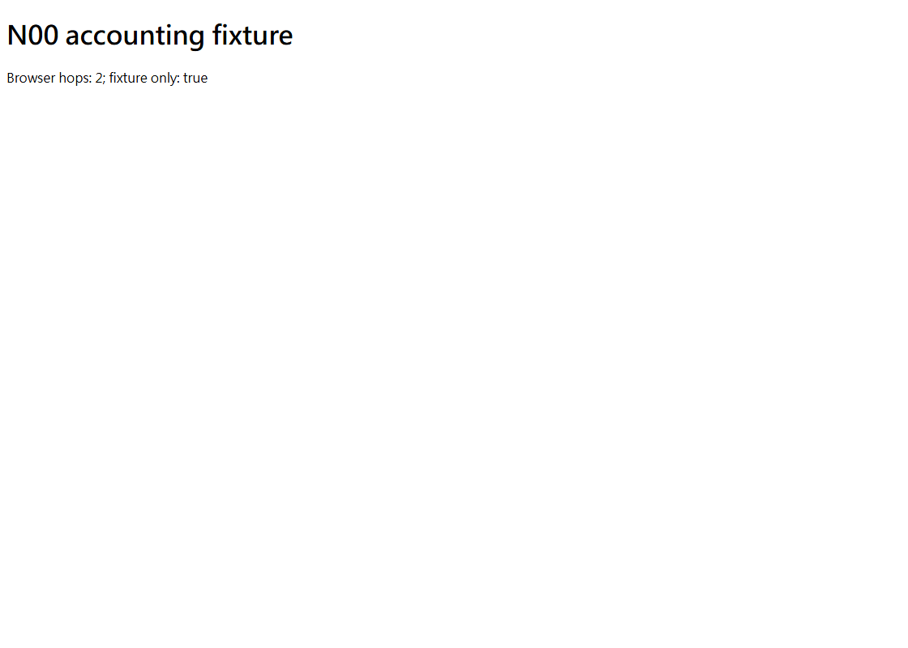

# N00 / F20 / NA01 — native Managed Auth SDK cleanup rehearsal

Reviewed source `050f0d03e49e867c9e5364865d3dc5f17bdc8fec`; initial source `5ecaa23abf6e3148a6964a1886b70442c3615987`; base `6c396a452fc48279ff093dc6984fdc0ad3a7e2a5`; branch `codex/n00-managed-cleanup-sdk`. **N00/NA01 remain OPEN; deployed SHA NULL.**

## Implemented

Six source/test files across two commits; aggregate diff in source.patch. Official pinned @neondatabase/auth0.5.0-beta client uses exact-id admin.listUsers (limit1/offset0) and admin.removeUser through the existing branded owned gateway. Only the journal-bound fictional identity and two admin paths are allowed; no email search/link, broad query, admin grant, impersonation or account creation. Fresh matching target readback and identity ID/createdAt precede removal. Empty exact filtered list with total0/limit1/offset0 is required for fixture absence; generic404/403/500, mismatched ID/time and malformed payload cannot establish absence. These semantics are candidate protocol assertions, not real Managed provider verification.

Cleanup/reconciliation use the existing20-request reserve after180auth checks; total200 remains enforced. Every physical hop reserves durably before dispatch. Unknown removal stays held; a restarted journal may only confirm fresh exact absence, never replay the removal. Accepted removal with identity still present also remains held. Receipts exclude cookies, email, body and role payloads; session header never grants BuyerOS membership. No real target/external executor accepted.

## Verification

|Check|Pass|Fail|Skip|
|---|---:|---:|---:|
|Observed complete RED|0|20|0|
|Final focused GREEN|24|0|0|
|Final15-file related Node suite|238|0|0|
|Owned Chromium accounting regression|3|0|0|
|STRICT EdDSA fixture|8|0|0|

Related Node 58663.4183ms; focused 17752.2554ms. Browser 7595.655999999999ms (CLI reports7.6s). Actual HTTP owned native SDK/direct-boundary captures25 across24cases; details in COUNTS.20original cases observedRED before implementation;3additional guard regressions ran as verification. Author review then reproduced whitespace/session-header replay:23pass1fail; canonicalized validated identity body, final24pass. Changed JSON whitespace or session headers cannot release its hold. Types/scopedlint/generatedcontracts exit0;84operations=70+14 unchanged. No domain DB suite applies to these Node protocol/filesystem-only changes; DB connections/migrations0,required DB skips0. Crypto STRICT=1 is a local key fixture, not Neon/API business integration. Sole Alembic head0037.

Windows/Node24.18.0/Python3.14.6/Chromium1120x800. SDK and lock/framework unchanged; no new build, no portable/Vercel output run this slice. Historical built output6cases each belongs to source2b69e7c and is not fresh acceptance here.3browser regressions exercise owned browser/SDK/fixed fixture CLI, not the BuyerOS staff journey. Screenshot below is the fictional accounting page.1existing asyncio deprecation warning.

## Retained failures and cleanup

Two initial red workers were interrupted after cases ran: capture hook read an absent historical fixture receipt before cleanup and leaked owned servers. Corrected hook preserves absence and cleanup; two exact fictional roots proved and removed. Initialgreen19pass1fail came from equating physical HTTPhits with180historical reservations; fixed fixture accounting still asserts pending durable execution reservation before dispatch. First manual cleanup guard refused without mutation due PowerShell date conversion; exact DateKindString validation then succeeded. CompleteRED/initialGREEN logs retained. Prior broad-root269pass5fail remains RED and was not rerun; normal main Vercel artifact/offer Docker timeout still unresolved. No weakened timeouts, tests or DB guard.

## Open gates and rollback

[Official Managed admin documentation](https://neon.com/docs/auth/guides/plugins/admin) requires an existing authenticated Auth admin session; no automatic role grant is authorized or implemented. Installed SDK wraps Better Auth1.6.23 while fetched Managed overview documents1.4.18; getUser helper is therefore not assumed compatible. Exact-id listUsers/removal/schema/absence, real OAuth, cleanup permission and ingress require fresh isolated real-target/account evidence. No provider API call, account/email/admin grant, paid resource, production database/auth/Cloudflare cutover, push or deployment happened. Auth0/users.id/memberships/actors/RLS/HMAC/delivery403 unchanged.

Original strict302 callback gate, full native browser/CLI accounting, human/multibrowser/staff journey and independent review remain OPEN; no agents authorized. N01/N02 full compatibility prerequisite unchanged. Next eligible is a specifically authorized isolated real-Neon/Google roundtrip with counted transport and reviewed exact cleanup authority; no stale approval reused.

Author review only. Reverse source patch applicability0; no revert or production rollback performed. Revert following metadata checkpoint then source050f0d0 then5ecaa23; no DB/resource undo. Existing unknown holds are not erased by rollback.

[Commands](COMMANDS.json), [counts](COUNTS.json), [capture provenance](CAPTURE_MAP.json), [retained failures](RETAINED_FAILURES.json), [source patch](source.patch).

