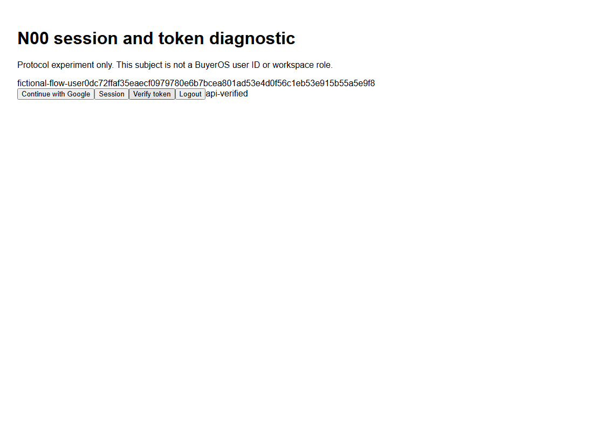
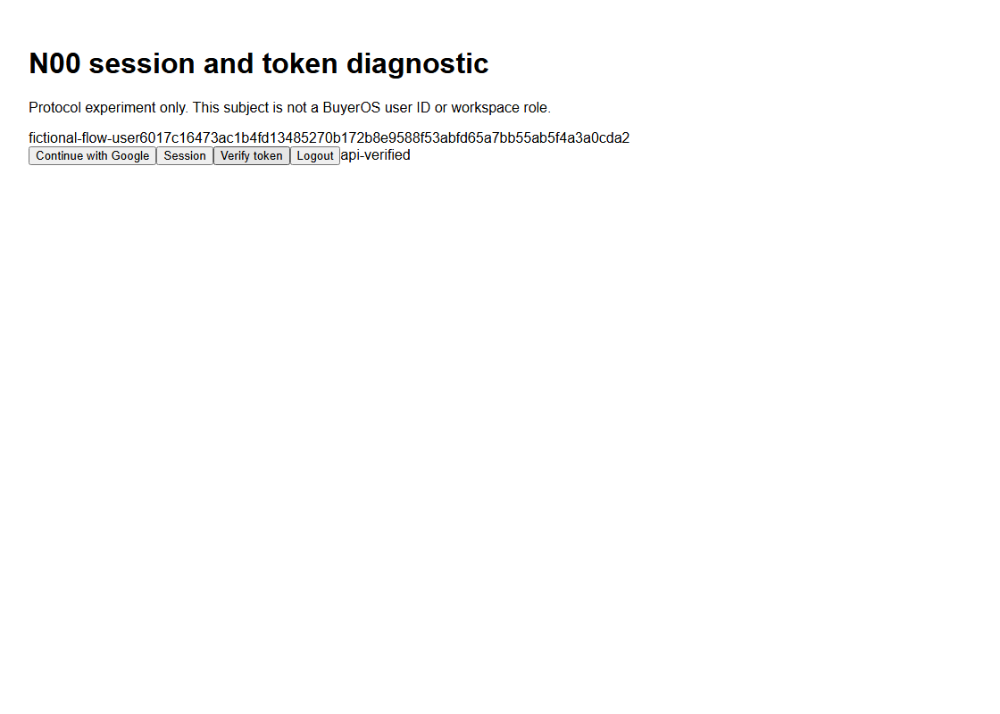

# N00 built session/token diagnostic (2026-10-05)

Reviewed source: c756596406f41884f61a3b64c8549f569e34cfa4. Base: 2eb4b388a4d669a80bd3f205804d97e3f3a81267. Local branch codex/neon-auth-compatibility-local-20261004. Deployed SHA: NULL.

## Implemented

27files/518insertions/1deletion. Strict request-runtime manifest/trust/TTL remains shared. UI uses pinned official SDK signIn.social/getSession/token/signOut; server getSession and callback middleware execute on actual emitted outputs. An independent owned FastAPI diagnostic checks explicitly configured issuer/audience, EdDSA/OKP/Ed25519, expiry and unique known key. It has no domain API, DB, memberships or canonical mapping. Browser receipt must match rendered target fingerprint/session subject; JWT is neither displayed nor persisted in local/session storage.

Separate fictional-only transport overlay maps exact HTTPS fixture Auth endpoints into the durable counted loopback proxy. Real/foreign targets, automatic redirects and retries are refused. Private owner-bound diagnostic is the only extra loopback transport. Fixture wire shape/counters do not prove real Neon/provider/CLI behavior. No public diagnostic route added to BuyerOS app.

## Fresh verification

|Check|Pass|Fail|Skip|
|---|---:|---:|---:|
|Related Node, serial files|144|0|0|
|EdDSA crypto|8|0|0|
|Actual Vercel built UI|5|0|0|
|Actual portable/workerd built UI|5|0|0|

Both UI CLI exits0/global errors0; each30fixtureAuthHTTP reservations/forwards,29accepted1rejected/0pending0unknown. Includes callback/JWKS; API401 negatives checked separately. Runtime secrets/IDs injected after build:2391Vercel/91portable text files scanned,0exact matches. All owned journals/private configs/roots/children removed; ports clear. Types/lint/generated contracts0. Single0037head/0migrations/0DBconnections. No required DB suite applies to this protocol-only slice; no skips suppressed. Python3.14.6 has one existing pytest_asyncio deprecation warning.

Linux Node22.23.2-bookworm-slim/4CPU/6GiB, Docker29.8.1, locked pnpm11.25.0; owner-verified read-only seed. Four clean commands0. Inventories274source destinations each; every regular archive member matches: initial79portable/2204Vercel,final95portable/2220Vercel. Final app overlay matches; only local launcher/Playwright startup changed after build, recorded separately. No SDK/output patch. Native runner Windows/Node24.18.0. Command/JUnit durations are environment observations, not product p95/SLA/performance acceptance.

## Retained failures

Baseline1UI failure; initial built Vercel4pass1response.json timeout (UI had checked headers only). Receipt consumption/context checks added; original status/body assertion passes. First final Vercel90sstartup and portable20sAPIreadiness attempts executed0tests, classified failures. Portable cleaned itself; Vercel owner/PID-absence native recovery copied journal before owned removal. Disk-only leak scan now precedes resource allocation; local API boot60s/total startup240s bounded, case45s/status/receipt assertions unchanged. Precise OS/Playwright cause unproven. Parallel144cases143pass1fail: existing40ms500case got503; unchanged deadline/assertion passes full serial144run. Initial types/lint retained; no rules disabled.

## F20/NA01/release gate

Local preparation implemented; fixture verified; actual local built HTTP integration verified. True Neon/Google, full SDK/browser/CLI accounting, external cleanup, canonical mapping/RLS, CSRF/rotation/multi-browser/real Vercel ingress, independent review and live staff acceptance remain open. Historical strict302failure unchanged/not rerun; new fictional managed307model does not close it. N00/NA01/Task2 OPEN; N01/N02/Q13 gates unchanged. Auth0/users/memberships/actors/workerHMAC/delivery403 unchanged. External auth requests0; no real accounts/email/roles/paid/push/PR/deployment. Fresh exact isolated target/account approval pending; expired approvals unused.

## Evidence/rollback

CAPTURE_MAP maps producer paths to byte-identical captures; SOURCE_HASHES binds27tested source files. Author review only. Reverse applicability0, not applied or production rehearsed. Revert source c756596 plus the following evidence/status commit; no DB/resource undo. Prior1148N00payloads plus31inputs unchanged; operation ledger84(70+14), guards and other tasks/cases preserved.

