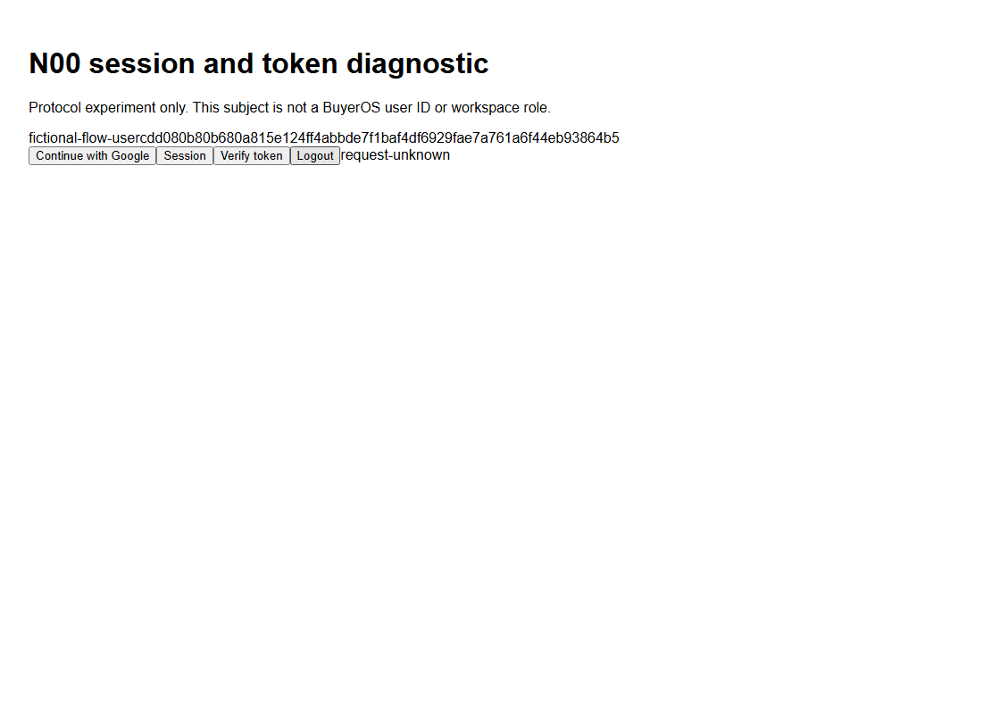

# N00 / F20 / NA01 — unknown auth transport recovery

Reviewed source `2b69e7cf8c0b0c738bfc34b3de44b1877468a0ca`; base `58b3cff65625c5abe55a0f8ab316b604989d8063`; branch `codex/n00-unknown-write-recovery`. **N00 / NA01 OPEN; deployed SHA NULL.**

## Implemented

Six source and test files changed: 112 insertions and 22 deletions. After dispatch, refused/malformed redirects remain unknown. POST/PUT/PATCH/DELETE and one-use callback/verifier GETs retain their in-flight/unknown hold. Callback state/verifier defines the GET intent; token renewal, query order and incidental fields cannot create a retry. Receipt fsync precedes journal settlement. Resumed unresolved journals hold all state-changing traffic without trusting legacy/corrupt receipt method metadata; reads remain available. There is no automatic hold-clear/replay API. One-shot owned loopback sign-out fault exercises the actual pinned SDK/client/handler/UI. Wrong owner403; no production route or SDK patch.

## Fresh evidence

|Check|Pass|Fail|Skip|
|---|---:|---:|---:|
|Final 14-file related Node suite|214|0|0|
|EdDSA fixture|8|0|0|
|Actual portable built UI|6|0|0|
|Actual Nitro/Vercel built UI|6|0|0|
|Earlier 27-file root MJS attempt|269|5|0|

Final types/scopedlint/generatedcontracts exit0;84operations=70+14 unchanged. Includes 13 new Node cases and one new UI case per target. MeaningfulRED22/10fail,24/2fail,built1fail. Unknown logout502 -> UI request-unknown -> Retry409; no second upstream write. Fresh read sees actual fictional committed sign-out. Both final runs38durable reservations37forwards,1unknown0pending; response outcomes/receipts in COUNTS and captures. No required DB suite applies to protocol/filesystem-only changes; no DB DSN/connection/migration or suppressedDBskip. Solehead0037.

Broader attempt remains RED: offer Docker run exceeded existing30s, plus parent; two new query failures sampled before final fix and now pass in214-case suite; the normal main Vercel entry missing. 274reported/273XMLleaves reflect parent counting. This attempt is not final-source project acceptance. Timeout/rootcause unproven; fixtures/assertions not weakened. Portable initial startup0tests notpass:APIready but workerd no HTTP in20s; exact owned cleanup verified; retry under same bounds passed. Other setup/lint/discovery/inventory failures retained.

## Artifact/environment conditions

Windows11/Node24.18.0/Python3.14.6/Chromium1120x800/loopback; SDK 0.5.0-beta unchanged. Reused genuine earlier LinuxNode22.23.2 Docker4CPU6GiB outputs:14compiledoverlays unchanged,95portable/2220Vercel regular archive members match bytes. New builds0; only launcher/proxy/fixture/test source changed. Runtime-only values leak-check91portable/2391Vercel files0 matches. All five run private roots/journals/children removed. Wall times are runner observations, no product SLA/perf or staff journey claim.

## Open gates / rollback

F20 remains open. Original strict302callback case/assertions untouched and notrerun; its historical500/200 is unclosed. Installed handleAuthRequest follows redirects; response allowlist lacks Location. This arbitrary raw proxy fixture is not the documented managed callback, and no production SDK defect or real-Neon compatibility is claimed. Actual Neon/Google, full native SDK/browser/CLI accounting, ManagedBetterAuth exact identity cleanup/absence, canonicalmapping/RLS, real ingress/rotation/CSRF/multibrowser/human UAT and independentreview remainopen. Auth0/framework/users/memberships/roles/historicalactors/HMAC/delivery403 unchanged. No agents, push, remotePR, account/email/paid/provider/production/Cloudflare/deployment action. PeerQ13 remains separate.

Author review only. Reverse source patch applicability exit0, not applied/production rehearsed. Revert following metadata checkpoint then source2b69e7c; no DB/resource undo. Legacy unknown journals deliberately remain held pending trusted reconciliation. Next N00 exact Managed identity cleanup/absence and actual transport preparation; specific fresh external target/account authority still required. N01/N02 gates unchanged.

[Commands](COMMANDS.json), [counts](COUNTS.json), [captures](CAPTURE_MAP.json), [rollback](ROLLBACK.json), [source diff](source.patch).

## Actual local built protocol screenshots

