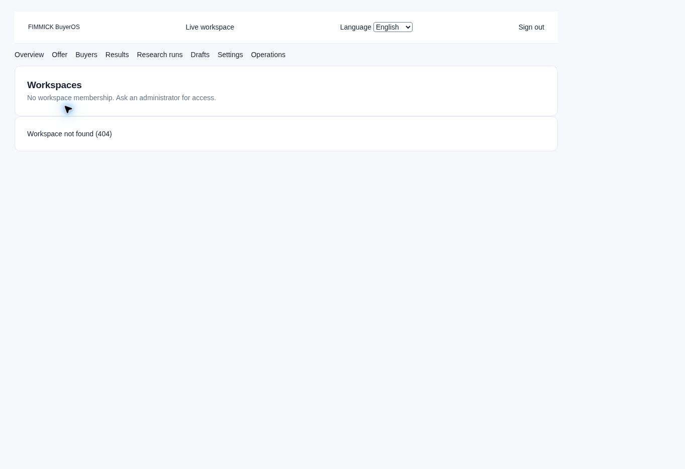

# BuyerOS 八模組與研究至外展流程稽核

稽核日期：2026-10-03（香港）｜對象：FIMMICK BuyerOS｜用途：現況判斷、UAT、Neon Auth 遷移與 Codex GPT-6 Sol 修復交接

## 1. 結論與可用性

**現有版本已有相當完整的 API、版本審批、買家名單、批量工作及 Cloudflare 執行架構，但本次不能驗收為可完整投入日常使用。** 正式登入成功後，首次載入工作區發生 500；重試後，現有登入身份沒有工作區 membership，指定工作區顯示 404，七個業務分頁停用。這不是「網站所有功能都壞了」的證據，也不能將曾通過的隔離 fixture 測試當成正式員工流程已通過。

此次保留上次 F01–F14，新增 F15–F21，共 **21 項缺陷、效率問題或驗收缺口**；沒有確認 P0。最高優先是工作區存取與首次 500、草稿人工修改後審批斷點、Operations 結果契約錯誤、研究重試去重，以及兩種查詢放大。**main 尚未實作 Auth0 → Neon Auth 遷移。** 之前 N00–N07 計劃仍待執行，本次沒有改動產品、會員權限、正式資料、供應商或部署。



## 2. 版本、範圍與證據界線

| 層次 | 本次核實 | 不能推論的事項 |
|---|---|---|
| GitHub | [YNWAforever/BuyerOS](https://github.com/YNWAforever/BuyerOS)，main `a78859fe474f5722be3755b10e2586436b53bf97`；2026-10-02 09:25:13 HK 合併 PR #10 | 與上次稽核 SHA 相同；沒有證據支持舊問題已修復 |
| 正式部署 | Vercel `dpl_7A95afQdDSUsaPRw2RnPFouQ1hEp`，production、READY、iad1；alias `buyer-os-nu.vercel.app`；source SHA 與 main 相同 | READY 不等於 DB migration、worker selector、provider 或員工 UAT 已就緒 |
| 網站 | [首頁](https://buyer-os-nu.vercel.app/) 為登入入口；[指定工作區](https://buyer-os-nu.vercel.app/app?workspace=900cd19b-4e03-4446-bdd6-7cb199d96060) 登入後無 membership | 未取得 operator／reviewer／admin 的正式業務畫面，不能宣稱實測八模組內容 |
| Runtime | `2026-10-02T19:40:34Z` 的 workspace request 500，request ID `1d123054-2633-40b7-8e07-b6aed83dad98`，後端 `OperationalError`；同期 Auth0 JWKS 回應 200 | 沒有底層 DB 原因、重複頻率、冷啟動／連線池證據；不能直接歸因 Neon 或 Auth0 |
| DB／worker | 原始碼 migration 至 0036；歷史 handoff 有隔離 preview 及 CI 證據 | 本次未讀正式 schema、runtime role、Queue／Workflow selector、epoch 或 backlog |
| 本地 | Python 61 pass／1 skip；JS domain 11、adapter 74、auth 8、run subscription 4、Vercel proxy 5、worker gateway 1 全通過 | 沒有完整 build、owned PostgreSQL、Cloudflare controller 或本次瀏覽器 fixture E2E 重跑 |
| 準確率／效能 | 真實函式的 query-call probe、兩組模板輸出比較、6 筆規則 fit fixture | 不是正式延遲、負載或真實研究／聯絡資料準確率 |

程式碼、部署 metadata 與正式畫面已分別取證。套件採 repo 鎖定版本；Node 24.19.0、Python 3.12.14。Python TestClient 在受限執行環境停滯，保存 45 秒 timeout 診斷後，以同一測試集合在允許的本機環境重跑，1.75 秒完成；沒有改動斷言。1 項 duplicate-provider settlement DB case 因沒有 Docker／隔離 PostgreSQL 跳過，不算通過。JS `--test` 外層最初只報 2 個檔案，另以各檔案直接執行取得 5＋1 個個別測試結果，沒有重複計數。

### 覆蓋分母

本報告的 `BuyerOS_Operation_Inventory_2026-10-03.csv` 是 **44 項代表性 UI 操作／流程檢查**，不是「所有按鈕」的窮盡清單。本次正式執行 7／44 項：3 pass、4 fail；其餘 37 blocked。失敗集中在入口／恢復／語言；blocked 不納入通過數。

八個指定模組均已追查入口、主要資料流及程式碼；**正式業務內容 0／8 可完成驗收**，原因是同一工作區授權阻擋。78 個 public API operation 在原 repo ledger 都有 handler 記錄，deployed 欄仍為 unverified；本次不把 78 個 API 算作逐一 live 通過。5 個 internal operation 另計。

測試案例文件保留上次 56 個案例 ID，新增 12 個，並保留 30 個 Neon Auth 案例，合共 **98 個**。按本次證據：7 pass、6 fail、5 blocked、80 not-tested。這些案例是驗收追蹤單位，不等於 164 個本次通過的自動檢查；source review、歷史通過、本次執行和 blocked 分欄記錄。

## 3. 八個模組：現在有甚麼、日常流程缺甚麼

| 模組／角色 | 目前原始碼能力 | 日常使用問題／缺口 | 建議畫面與驗收 |
|---|---|---|---|
| Overview／所有會員 | Workspace／project scope、六張工作入口卡、usage、ICP approval、admin archive | F17：畫面標 project，failed jobs 卻查 workspace；部分卡只有入口，沒有待辦數、owner、到期日或直接待審列表；F14 資訊層級弱 | 頂部精簡 scope，主區「今日待處理」按 owner／project／狀態顯示；統計與點入列表採同一 server filter；A 專案零失敗、B 五失敗時 A 不顯示五 |
| Offer／operator、reviewer | 四步 wizard、建立／編輯、文件摘錄、事實來源、版本、exact ICP approval；儲存不啟動研究 | 多步保存已有 ActionIntent 與部分成功提示，應保留；編輯時先下載全部 ICP versions 才找到 latest；真實文件抽取和審批未 live 驗證 | 固定進度及保存狀態；成功後直接到「審批買家輪廓」；失敗保留輸入；版本衝突顯示差異；latest metadata 按需取得 |
| Buyers／operator、reviewer | Snapshot、搜尋／fit／review／queue／排序、跨頁選取、證據詳情、名單、notes、owner、review、export、contact quote、draft 入口 | F06 同事分派缺失、確認可沿用；F07 輪詢放大；F11 上限 1,000；F14 管理表單堆疊 | 篩選列＋結果主區＋固定選取工具列；顯示「本頁／跨頁／排除／總數」；drawer 內處理證據與 review；未選取時隱藏批量表單 |
| Results／operator、reviewer | Usage、相同 buyer results 元件、手動 reply／meeting／opportunity／disqualified、append-only correction | 與 Buyers 重疊；usage 在清單前佔位；Outcome 必須先選 buyer；手動結果不代表 mailbox 有回覆 | Results 聚焦漏斗、花費與人工結果；明確標「人工輸入」；可按 buyer／owner／期間篩選；空分母用 —，UTC 邊界與修正鏈不變 |
| Research runs／operator | 分頁 run history、target 1–100、cost cap、status／stage／cost／hold、事件更新、安全 retry／cancel | F08 遺失回應後換 key；F10 provider allowlist 空；沒有在開始前把可用能力與解除阻擋步驟集中展示 | 先檢查 approved ICP／budget／provider／worker；不可用時給具體原因與管理員入口；開始後可回查同一次意圖；unknown 不自動重做 |
| Drafts／operator、reviewer | 已審核 sender、facts／evidence／recipient、免費模板、revision、exact review／approval、approved export；delivery 停用 | F09 tone／objective 不影響正文；F16 人工改稿後沒有重新 grounding 路徑；F19 Refresh draft 可覆盖未儲存內容；原始 ID／hash 過度佔位 | 以「選買家→資料→改稿→來源覆核→審批→匯出」呈現；進階 ID 收於 details；dirty refresh 先比對／確認；不同版本必須重新批准 |
| Settings／admin | 會員 roles／active、last-admin server guard、偏好、預算、policy decision | F03 只首 100 人；F04 ID 尾 8 碼難辨同事，沒有 invitation／onboarding 完整流程；F02 空狀態不能切語言 | 伺服器搜尋／分頁／總數；可辨識名稱＋合適權限的身份欄；角色變更逐人預覽及原因；不把普通 buyer 批量操作直接套到權限管理 |
| Operations／admin、其他會員受限 | Readiness、capabilities、profile／failed queue、jobs list、job lookup、audit pagination；非 admin 有 actor restriction | F05 result `id` 被讀成 `buyer_id`，結果只首 20；F17 workspace／project語意混雜；F10 readiness 缺責任人、checked_at 與下一步 | Summary、工作列表、結果详情分開；使用 generated contract；結果分頁、可讀原因、可權限控制的重試／取消；每能力有最近檢查時間和下一步 |

上述後台畫面建議來自本次 source trace；不是假稱已觀看目前受權後台。390px／200% zoom／screen reader 的實際驗收仍列在 U10／U11，不以 CSS 或歷史圖片取代。

## 4. 完整研究及外展流程

| 步驟 | 正確輸入與輸出 | 現有保護／本次缺口 | 對應案例 |
|---|---|---|---|
| 1 登入、選 workspace／project | 身份對應既有 canonical User、active membership、角色 | 正式 F01／F21；換 Neon 不會自動補 membership | U01–U05、NA04–NA09 |
| 2 建立／更新 Offer | 欄位、文件、摘錄 → project＋ICP version | 保存、If-Match、部分成功已設計；本次 live blocked | U09、WF01 |
| 3 審批 ICP | reviewer 檢查 facts／requirements／版本後批准 | 必须匹配目前 offer revision；不能略過這步開始研究 | U09、WF02 |
| 4 開始 Research | 已批准 ICP＋target＋上限＋能力 → run／outbox／hold | F08 uncertain response；F10 真 provider 未選 | B05／B06、U09 |
| 5 執行、失敗與恢復 | events／checkpoint → committed buyers、settlement | 保留已完成資料；unknown 要 reconcile，不能盲重跑或釋放 hold | R02／R03／R06、S03 |
| 6 評估與人工 review | 有效 evidence → fit verdict → accepted／rejected／needs information | 6-case deterministic tests 非實際準確率；F12 | A01、A03–A06 |
| 7 建名單、分派與批量維護 | 凍結 ID＋version，逐列 outcome，failed-only retry | F05–F07／F11；100／101、1000／1001 是必要邊界 | B01–B16 |
| 8 Contact quote／confirm | 先查資格、價目、上限、到期，再確認 | 真 contact provider 不可用；不能拿格式合法當聯絡身份準確 | A08、S04 |
| 9 選 recipient、sender、facts | 有效 retention、policy、accepted buyer → draft job | sender 必須審核；沒有 recipient 的草稿不能進 addressed approval | U09、NA27 |
| 10 產生及人工修訂 Draft | 有來源正文 → revision＋claims | F09 UI 承諾不一致；F16／F19 修改與恢復斷點 | A02／A07、D01–D03 |
| 11 精確審批 | 當前 recipient／sender／revision／sources／policy context 全部一致 | 維持後端重新驗證；UI 不可以直接把 grounding_status 設成 grounded | D01／D03、U09 |
| 12 匯出、人工外展及 Outcome | 已批准且有權限匯出；員工在外部另行操作；手動記錄結果 | 寄送 endpoint 明確 403 DELIVERY_DISABLED；本次沒有寄信。自動 outreach 不是現有已完成能力 | U09、NA27 |

代表性案例使用「Audit SensorCo HK」及 `example.invalid` 虛構公司、虛构買家、隔離身份與假供應商。這只是驗收資料，不是真實客戶。正式會員未恢復前，完整 flow 維持 blocked；本地單元測試不會把整條鏈標 pass。

## 5. 問題與證據

證據狀態：`verified`＝本次 live 或明確本地重現；`code-only`＝原始碼／契約確認但未於正式流程重現；`blocked`＝必要存取／外部配置不足；`not-tested`＝尚無本次執行證據。嚴重度與證據強度分開。每項來源片段、行號與 SHA 收於 E03。

### F01 · P1 · 指定工作區無 membership，缺少恢復路徑 · verified

本次重試後看見「No workspace membership」及「Workspace not found (404)」。可能是目前登入方式的 issuer／subject 沒有對應會員，不能斷言工作區不存在或 server 授權錯誤。`workspace-picker.tsx:183–185` 空狀態沒有重新檢查、支援 request ID 或管理員聯絡入口。修復 Q01；管理員須核對精確身份映射，不因 email 相同就合併或授權。U01 blocked、U02 fail；E01、E03。

### F02 · P2 · 最需要協助的空狀態不能切繁中 · verified

`workspace-picker.tsx:69–70,177` 把 localeReady 綁在有權限的 workspace；本次 Language disabled。顯示語言應可在登入／無權限／服務出錯時選擇，再與會員偏好同步。Q01；U03；E01、E03。

### F03 · P1 · 成員管理漏掉第 101 位以後 · code-only

`settings.tsx:26–28` 固定 offset0／limit100 並丟棄 total，沒有下一頁；API 本身支援分頁。Q02 應增加 server pagination／search，不能一次載入全部替代。250 人、同名、角色限制、版本衝突共同验收。U06；E03。

### F04 · P2 · 會員辨識及 onboarding 不完整 · code-only

同頁 MemberRow 只顯示 `user_id.slice(-8)`，無法按正常人員資訊管理。現版只允許修改已存在會員，沒有完整邀請能力。保留 last-admin server guard；先提供受控 onboarding 及清楚身份，再設計邀請到期／接受／撤回。Q02、Q09；U07／U08；E03。

### F05 · P1 · Operations 結果欄位錯誤及分頁缺失 · code-only

`operations.tsx:11,77–88,122–125` 使用自訂型別與 `buyer_id`，producer `bulk_service.py:184–186` 回傳 `id`；有效 payload 的 ID 因而讀成 undefined。結果查詢只有 offset0／limit20，無第二頁。Q03 用 generated AsyncJob／BulkItemResult、實際 HTTP fixture render、完整 ID及分頁修正。B10／B11；E03。

### F06 · P2 · 批量分派限制及確認未綁選取內容 · code-only

`bulk-actions.tsx:31–60` 只有分派給自己／無 owner，沒有同事 picker；confirm state 不隨 selection／reason 改變而重設，parent key 只含 workspace／project。Server 的逐列版本檢查仍在，這不是已證實越權。Q05 以 scope＋selection＋target＋reason fingerprint 清除確認；有資格同事可搜尋。B02–B04；E03。

### F07 · P1 · Bulk 每兩秒重新讀取所有歷史结果 · code-only

`bulk-actions.tsx:73–98` 每輪從 offset0 開始，逐頁取得全部結果；setInterval 不等上一輪完成，無 visibility pause／backoff，cleanup 未取消請求。1,000 個已處理結果、100／頁、running 時約 300 requests／分鐘／view 是推算上界，不是正式實測。Q06 拆 summary 與按需結果頁、單一 in-flight、完成後再排程、隱藏頁暫停。B12／B13、P04；E03。

### F08 · P1 · Research uncertain response 可能產生第二次意圖 · code-only

`run-progress.tsx:90–103` 每次 start 新建 UUID。首次已 commit 但 202 遺失後，使用者重試會使用新 key；busyRef 只擋同時操作。未觀察實際重複收費。Q04 套用已存在 ActionIntent，保留 scope、body、ICP version；結果未明先 replay／查詢，另設「全新研究」。B05／B06；E03。

### F09 · P2 · Tone／objective 不改變模板正文 · verified

本次重新呼叫真實 `render_grounded_template`：兩種 tone／objective 的 subject／body 完全相同，只有 metadata 不同。Q07 應明示免費固定模板並移除無作用選項，或實作不新增收費依賴、仍受引用約束的風格／CTA規則。A02；E06。

### F10 · P1 · 真實能力與正式執行仍缺 activation 驗收 · blocked

`providers/base.py:16` 的 SELECTED_LIVE_PROVIDERS 空白，production fixture 禁止；delivery 明確停用。這是正確的 fail-closed 保護。現有 Cloudflare／native／checkpoint fixture 證據不代表正式 selector 已啟用。Q11 列出每能力可用性、最近檢查、owner、阻擋原因；按真實供應商分別核實價格、權限、quota及有上限 canary。R02–R04／R06、P08；E03。

### F11 · P2 · 超過 1,000 買家不能一次維護 · code-only

clipped snapshot 禁止 Select all filtered 是正確保護，但使用者只能再切篩選。Q08 使用持久化 manifest、穩定 ID／version、分段工作、逐列結果及失敗集；不直接將前端上限放大。B14／B15；E03。

### F12 · P1 · 缺代表性 performance／accuracy 驗收 · not-tested

本次 fit test 的 6 個人工 fixture 通過，但沒有真實 research gold set、contact 核驗、跨供應商差异或正式 p95。Q10 按下節方法建立分層資料、基線及結果；資料不可得時保持 blocked／not-tested。A03–A08、P01–P08；E04、E08。

### F13 · P2 · 歷史 checkpoint 與目前狀態混雜 · code-only

`REMAINING_DEVELOPMENT_STATUS.md` 和 handoff 累積多個「Current」，部分文字仍稱 draft／no merge；main 已合併。API ledger 每列 deployed unverified，不能只因 app SHA一致就批量改成 verified。Q11 建立單一 current status：code／deployment／schema／jobs／provider／UAT 各有时间與證據，舊文件標 historical。R01／R05；E02、E03。

### F14 · P2 · 日常工作重點與畫面層級不足 · code-only

八模組 source 顯示 scope、filters、export、owner、lists、job panel 堆疊；Overview 多張卡只有通用 Open，Draft 審批把多個 ID／hash直接作主要內容。這是有來源的 UX 評估，未當作本次受權後台的手機視覺結果。Q09 重整資訊層級並由 3–5 名員工完成五項固定任務；U09–U12；E03。

### F15 · P2 · 登入初始化誤報「未設定」 · verified

本次 callback 先顯示「Live sign-in is not configured」，其後正常完成登入。Provider hydration 初期刻意 `auth:null`，callback 卻即時把 null 當未配置。Q01 應分 initializing／configured／configuration_error／callback_error；未完成初始化不發 alert、不提示改 Auth0。U13；E03、E07。

### F16 · P1 · 人工修改草稿後無法完成重新審批 · code-only

`draft_service.py:349–351` 清除 claims 並設 needs_review；`approval_service.py:125–127` 拒絕非 grounded／空 claims；`drafts.tsx:289` 只有 claims.length>0 才顯示 Request exact review。既有訊息叫人重新 grounding，卻沒有對應 UI／API 路徑。本地實際 approval gate 亦拒絕供入的 edited-state fixture（E06），但未跑持久化端到端。Q12 增加人工來源覆核流程及 version binding；不得繞過引用／政策檢查。D01／D03；E03、E06。

### F17 · P2 · Project 工作台顯示 workspace 工作數 · code-only

Overview 標示目前 project，但 `overview.tsx:71` jobs query 未帶 project_id；Operations 的 list／failed count 也未帶，API `jobs.py:24–41` 本來支援此 filter。不同 project 的失敗工作會混入 project 情境；未發現跨 tenant 洩漏。Q14 明確選 project 或 workspace範圍，統計、列表、deep link 使用同一 query。U15；E03。

### F18 · P1 · Workspace 列表先掃所有 workspace，才切頁 · verified

`routes/workspaces.py:24–55` 對已知 user 先讀所有 workspace，再對每個執行 set_config＋membership query；offset／limit 最後才對 Python list 切片。本次 fake connection 執行真實路由函式，1／10／100／1,000 個 workspace 分別為 4／22／202／2,002 次 execute；第2頁仍2,002。這確認演算法呼叫量，不是實際 SQL延遲。Q13 建立受限制的 actor membership discovery 與 DB端分頁，保持 RLS／撤回語意；不開 BYPASSRLS 作快捷修復。P09／P10；E03、E06。

### F19 · P2 · Refresh draft 可以覆蓋未儲存的修訂 · code-only

`drafts.tsx:174–179` 不檢查 unsaved，就把 subject／body／language 換成 server值；按鈕亦只看 busy。Open draft 的確認文字問「Save changes…」，按確定卻直接換稿，沒有保存。Q15 提供清楚 Save／Discard／Cancel 或保留本地比較；Refresh job 載入結果亦需同一 guard。D02；E03。

### F20 · P1 · 已要求 Neon Auth，但 main 尚未遷移 · code-only

這是需求狀態缺口，不是 Neon 出錯。`layout.tsx` 仍注入 BUYEROS_AUTH0_*；browser 仍用 authorize／oauth/token／v2/logout；FastAPI TokenVerifier 只允許 RS256。不得只換 issuer 環境變數。沿用 N00–N07，先做 Vinext／Nitro 相容 spike、canonical User identity map、Neon token verifier與 session生命週期，再受控切換；NA01–NA30；E03、E09。

### F21 · P1 · 正式首次工作區請求 500，需要追根因 · verified

畫面顯示 Service temporarily unavailable，依 request ID 查到 GET /v1/workspaces 500／OperationalError；按 Retry 後畫面轉為無 membership。Q16 調查 DB連線、pool、schema／role、timeout 與部署環境的同時間關聯；目前只有錯誤類別，原因未知。Q17 只能在Q16有結論後作最小修復，不先加大pool或無限重試；讀取重試有上限，寫入不能盲重試。U16；E07。

## 6. 效能、正確性及可維護性驗收

### 本次實測與限制

| 項目 | 方法及樣本 | 結果 | 限制 |
|---|---|---|---|
| Python 基礎／身份／provider／fit | 9 個測試檔、62 cases；鎖定依賴；無正式DB變數 | 61 pass、1 DB skip、1 warning；1.75秒 | 非 full suite；沒有 DB隔離／RLS 本次重跑 |
| JavaScript domain／adapter／OIDC／run／gateway | repo現有指令；11＋74＋8＋4＋5＋1 | 103 checks pass | 無本次 React UI render／正式 provider |
| 模板控制 | 同 facts／evidence，2 組 tone／objective | subject／body相同、metadata不同 | F09本地重現；不是人類草稿品質評分 |
| Workspace讀取 | 真實路由＋fake SQL connection，5種 total／offset | `2+2W`，1,000→2,002次；page2仍2,002 | 量測 execute calls，不含DB或網路延遲 |
| Fit規則 | 6個 fixture，含引用約束 | verdict與標記一致、unsupported citation0 | 不估算實際 precision／recall |
| 正式網站 | 登入、首個錯誤、一次Retry、最終空權限狀態 | 500後read成功但無membership | 沒有代表性流量分母；不報正式可用率／p95 |

### 待執行的效能試驗

以下是**建議驗收目標**，不是既有 SLA 或本次量測值。先記錄版本、區域、資料大小、actor數、網路條件及冷暖定義，再開始量測；測後不調低門檻來製造通過。

| 試驗 | 固定資料／負載 | 暫定門檻與量測 |
|---|---|---|
| P01、P06：開啟 Buyers | HK端測試；桌面與390px；每個冷／暖條件30次，登入另計 | 暖互動ready p95≤2s、冷≤4s；LCP≤2.5s、INP≤200ms、CLS≤0.1；同報p99、錯誤、樣本數；區分實驗室與真實RUM |
| P02、P03：API／SQL | 1k及10k買家；1／10／100 workspace；1／10／25 actors；10分鐘階梯負載 | 暖read p95≤800ms、p99≤1.5s、5xx<1%；記CPU／pool／DB耗時／queries／bytes；錯tenant 0 |
| P09、P10：workspace discovery | 1／10／100／1,000 workspace；同user membership數固定；各頁100筆 | query count不隨無關workspace數線性增長；隔離PG先取EXPLAIN；active／revoked／cross-tenant均正確；不放寬RLS |
| B12、B13、P04：bulk輪詢 | running＋1,000 persisted results；RTT2.5s；10個views，60秒；含429及hidden | 每view至多1個進度輪詢在途；未開結果頁不重讀所有結果；hidden停止；Retry-After有效；保留前後requests／bytes／DBcount |
| P05、P08：背景公平性／成本 | 10 workspace、短長／timeout jobs；30分鐘受控負載與30分鐘idle | 記queue p95 wait、oldest age、hold、重試、吞吐、compute與requests；無starvation／無無意義idle loop；成本不超批准上限 |

不可對正式站作未設上限的壓測或啟用收費供應商。先在隔離 DB／假provider 完成；有明確環境與額度後才做canary。

### 真實資料與 AI 準確度

建立至少200公司、按市場／語言／buyer type／同名異國／子公司分層的去重 gold set；兩人獨立標記並解決分歧，保留來源網址、擷取日期和reference verdict。開發集／holdout按公司隔離，避免同公司證據洩漏。報告 match precision、recall、needs_review比率、coverage、entity錯配、expired citations及信賴區間；建議 match precision≥95%，但同時披露召回率，不能全部標needs_review來「通過」。

每個可用模型／provider／設定，在holdout重跑3次，記runID、版本、成本及差異；真provider尚未可用時不填實測結果。草稿逐句查引用支持、offer事實、recipient和policy、語言及CTA；測試集中未支持陳述／跨tenant或錯公司引用應為0。Contact的email格式、provider_marked_valid與實際任職／公司關係分開評估，不用發真信測「準確率」。

### 可維護性規格

1. API consumer 使用 generated schema／operation client，刪除重複手寫 Job等DTO；CI增加producer payload→consumer render契約案例，不能只驗HTTP200。
2. 將 query keys、workspace／project filter builder、分頁和可取消讀取共用，防止同一數字與列表使用不同scope。
3. 將ActionIntent、確認fingerprint、dirty guard與job poller共用；保留業務差異，身份與權限批改有獨立流程。
4. 合併分散字典，新增zh-HK key檢查、錯誤原因映射與可追蹤requestID；debug ID／hash放details，正常同事不需理解內部schema。
5. 改動優先限制在受影響模組；不要以全站重寫、換框架、換Cloudflare執行方式掩蓋現有缺陷。每PR附案例、紅綠證據、rollback及未測範圍。

## 7. Neon Auth 與修復順序

沿用已交付的 N00–N07／Q01–Q11 ID；本次新增 Q12–Q17。`BuyerOS_Implementation_Tasks_2026-10-03.csv` 提供依賴、角色、粗略人日、驗收、案例、rollback及blocker。所有產品修復尚未由本次稽核執行，不能標已驗證完成。

| 批次 | 任務 | 完成條件 |
|---|---|---|
| 0：可觀察與存取 | Q01、Q11現況欄、Q16調查；N00相容性spike | 語言／auth狀態正確；管理員核對精確membership；500有可重現根因；現況文件分層清楚 |
| 1：防錯和流程斷點 | Q03、Q04、Q05、Q07、Q12、Q15；Q17按已查明根因修復 | job ID與全部結果可讀；lost202只一意圖；selection改動需重新確認；人工修改可完成來源覆核及審批；dirty內容不丟失 |
| 2：Neon身份與session | N01→N02／N03→N04→N05→N06→N07 | 原users.id／membership／歷史actor關聯不變；雙issuer有期限與撤回；preview重跑完整員工流程；正式切換後readback及rollback可用 |
| 3：效率和批量 | Q02、Q06、Q08、Q09、Q13、Q14 | 250會員全部可達；10k分段維護可恢复；summary輪詢有界；workspace讀取不掃全域；統計／列表scope一致 |
| 4：服務啟用與UAT | Q10、Q11餘下release gates | 真provider／效能／準確率／staff UAT有獨立證據後，才驗收所批准的能力 |

第一個實作 PR 建議做 **Q01 的UI部分＋Q03＋Q04＋Q15**，都可用虛構資料在本地完成，不需等待正式授權恢復。N00可先做隔離spike；Q12另開一個有明確審批模型的PR。Q16若只能拿到OperationalError類別就標受阻，不臆測根因；不應因此停止其他独立修復。

Neon官方文件於本次重新核對：Managed Better Auth以session cookie維持瀏覽器登入；外部FastAPI使用短期JWT。JWT為EdDSA／Ed25519、15分鐘，iss／aud是Auth URL的origin，JWKS在完整Auth base URL下；不要延用只接受RSA／RS256的現有verifier。先驗證Vinext／Nitro的同源handler／cookie／callback輸出，不能假設標準Next SDK可直接使用。canonical User identity mapping是本產品的遷移設計，並非Neon會自動提供；workspace RBAC仍由BuyerOS資料庫決定。Cloudflare私有worker HMAC維持獨立。密碼／OAuth migration方法必須實際核實，預設採受控重新登入／reset，不承諾可匯出Auth0密碼。

官方參考：[JWT](https://neon.com/docs/auth/guides/plugins/jwt)、[Next.js Server SDK](https://neon.com/docs/auth/reference/nextjs-server)、[Production checklist](https://neon.com/docs/auth/production-checklist)。本次只查文件，沒有建立Neon Auth服務或寄驗證電郵。

## 8. Codex GPT-6 Sol 第一批執行提示

```text
你正在 BuyerOS 工作。先讀 repo 的 AGENTS.md（如有）、本報告、Operation Inventory、Test Cases、Implementation Tasks及 evidence/E02、E03、E06、E07。
重新取得目前 main／工作分支／production source SHA；本報告基線為 a78859fe474f5722be3755b10e2586436b53bf97。若已變更，逐項重查F-ID，不重做已完成工作。

這次先實作Q01的初始化／空狀態／語言UI、Q03、Q04和Q15。分小PR、使用既有generated contract與ActionIntent，不重寫整個產品。Q16同步只讀調查500；無根因則記blocker。
Q01：auth initializing不能當config_error；無membership也可讀繁中，提供可重試access與安全support資訊；不自動新增會員或依email升權。
Q03：Operations改讀BulkItemResult.id，使用generated type，補結果分頁；21／101 rows和actual payload render測試。
Q04：Start research同意圖跨lost202重試用同key，body／scope／ICP改變才新intent；隔離DB驗證只有一run／outbox／經濟意圖。
Q15：Draft refresh／open／job materialization統一dirty guard，按鈕語意與真正Save／Discard／Cancel一致；取消不改任何本地內容。

另以N00開始Neon Auth相容性spike，按N00–N07計劃遷移；保留canonical users.id、memberships與歷史actor；禁止email自動link、禁止把Neon role當workspace role。不要只替換AUTH0_ISSUER。
Q12必須補人工引用覆核流程，不能用設grounded=true繞過審批。

執行相關unit／contract／UI及必要owned-Postgres測試。記錄SHA、命令、pass/fail/skip、artifact；缺DB不得將skip當pass。以同case ID更新矩陣，產品修改只有驗收成功才標「已驗證完成」。
不啟用real provider／delivery，不發外展訊息，不改正式會員，不自動部署或migrate production。完成可review的變更、測試及rollback後交接；只有另有明確授權才做正式切換。
```

## 9. 證據索引與尚需補充

| 證據 | 內容 |
|---|---|
| E01 | 本次正式workspace blocked screenshot；無憑證與正式客戶資料 |
| E02 | GitHub main與production deployment基線；目前DB／worker讀回仍unknown |
| E03 | 21 findings對應 source paths、行號片段、SHA及hash |
| E04 | Python61pass／1skip JUnit與log；另保留受限環境timeout診斷 |
| E05 | domain／adapter／OIDC／runs／proxy／gateway本次輸出 |
| E06 | 本次local probes JSON及可重跑Python腳本；明列fake connection界線 |
| E07 | Live觀察時間線與精確requestID runtime log摘錄；不含callback code／token |
| E08 | repo內原有CF07 benchmark的來源與方法；標明historical，不冒充正式量測 |
| E09 | 本次Neon官方文件核對摘要及連結 |

完成剩餘正式 UAT 最少需要：在本瀏覽器可使用、對應指定workspace的已授權會員（operator／reviewer／admin角色按案例提供），以及可丟棄測試資料的隔離環境。管理員須核對issuer＋subject和membership，不能只回覆「同一電郵已加過」。本次沒有自行修改會員／角色，也沒有要求用戶把密碼或token貼在對話。

即使membership解決，real search／contact／job activation、正式DB schema／role、恢復演練與真實準確率仍須各自驗收；存取恢復不等於整體可上線。發送能力目前明確停用，本報告的「研究至外展」驗收到已批准匯出及人工outcome，不能宣稱自動寄送完成。
