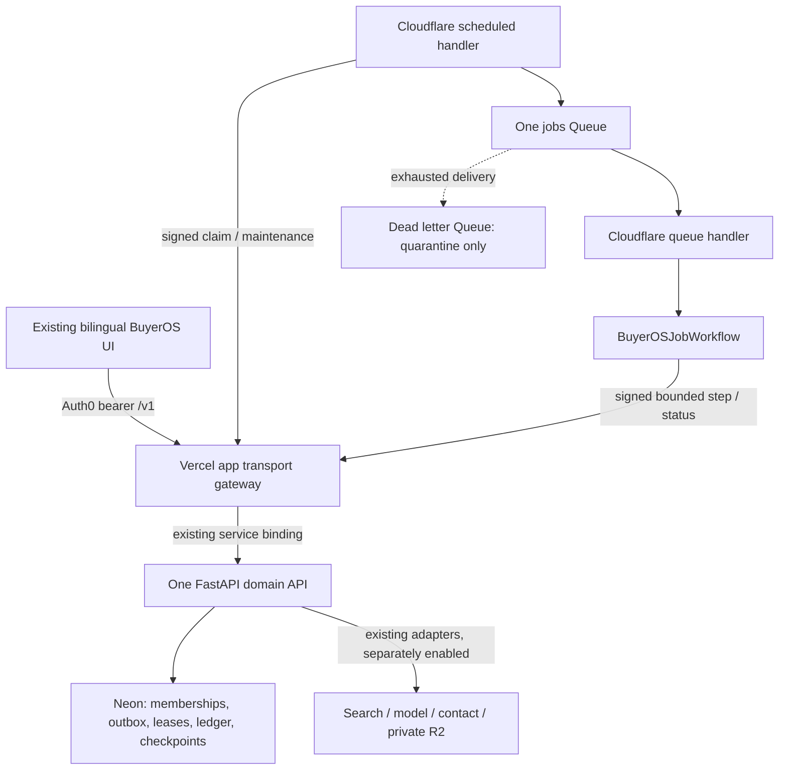

# BuyerOS Cloudflare job migration design

Date: 2026-10-01, Asia/Hong_Kong. **Status: proposal for review; planning only.**

The user requested a Cloudflare migration plan after asking whether Workers could replace the proposed Render worker. This authorizes preparing this document and the implementation plan. It does not approve replacing the current Celery/Valkey requirement, paid resources, production migrations, deployment, provider calls or execution of existing production jobs. No owner approval record is created by this proposal.

## 1. Outcome and scope

Use Cloudflare for durable job scheduling and orchestration while preserving the current BuyerOS frontend, Auth0 login, Neon data, financial ledger, domain rules and staff journey. Remove the need for continuously running Render worker/dispatcher processes and a Valkey broker **after an approved cutover**.

**Recommended design:** a TypeScript Cloudflare Worker uses Queues and Workflows to call bounded Python execution steps in the existing Vercel FastAPI service. Python business logic remains in one authoritative package. This is a migration of the job runtime; Python computation still consumes Vercel resources. It is not a proposal to execute the existing Celery process inside an ordinary Worker.

No frontend hosting migration, second domain API, Node business backend, Cloudflare D1 database, replacement financial ledger, new provider or sending capability is included. Auth0 bearer tokens remain in browser memory; current memberships, RLS, actor-bound snapshots, fixed-point money and exact-context approvals remain authoritative.

The implementation sequence is [the accompanying plan](../plans/2026-10-01-cloudflare-job-migration.md). Execution, if approved, stays in this session using `superpowers:executing-plans`; no agents are assumed.

## 2. Verified source and conflicts

| Item | Observation in this planning session |
|---|---|
| Origin / branch | `https://github.com/YNWAforever/BuyerOS.git` / `codex/fix-vercel-tslib-ssr` |
| Plan source | `aed7a7eb2b7370c10cd7a41306eecf09d378ad42`; starting diff clean |
| Migration owner | FastAPI/SQLAlchemy/Alembic. From `services/api`: `.venv/Scripts/python.exe -m alembic heads` returned `0033_api_rate_windows (head)`, exit 0. No database connection or migration. An initial root invocation failed because its relative script directory was wrong; it is not counted as a successful check. |
| Existing hosting | `vercel.json`: `app` (Nitro/Vinext) and internal `api` (FastAPI); app-to-api binding `BUYEROS_INTERNAL_API_URL`; catch-all routes to app. `app/v1/[...path]/route.ts` proxies `/v1/*`. |
| Current worker | `services/worker/buyeros_worker/tasks.py` imports Celery and dispatches Python handlers; `dispatcher.py` claims rows before publishing and keeps its round-robin cursor in the process. |
| Native dependencies | `psycopg[binary]`, SQLAlchemy, `pypdf==6.19.0`, `langgraph==1.2.12`, `langgraph-checkpoint-postgres==3.1.2`; PDF parser starts a child process with an 8-second timeout and sanitized environment. |
| Existing long work | Fit loops through up to 100 buyers; contact and research can process multiple operations. These loops must become resumable bounded steps. Moving the whole loop to one HTTP call is insufficient. |
| Existing production facts | The ledger records deployed main `12327c7`, reviewed application `4181062` and human FIMMICK/admin visibility. These historical facts were not rechecked against cloud accounts during this planning turn. |
| Existing test facts | CI evidence at `e061d33` records API 577 and worker 174 passes, zero skips, plus browser/launcher gates. These are retained baseline results, not Cloudflare verification. |

Read: `docs/buyeros/00_README_AND_DECISIONS.md`, `03_DATA_API_AND_STATE_CONTRACTS.md`, `decisions/BO-001-runtime-identity.md`, BO-011, BO-020, BO-026, BO-027, current status/task registry and Render setup runbook. Also read relevant runtime, money and limit sections of the supplied 2026-09-27 `SPEC.md`. Those older plan-only and numbered migration proposals do not override newer code or the user's execution authority.

The proposed exception is specific: replace **Celery + one Valkey + continuous Render job processes** with **one Cloudflare job transport and Workflow controller**, keeping PostgreSQL outbox/leases and one Python domain owner. Render configuration remains available as an unactivated alternative until a decision is approved. Ordinary Workers run Python through WebAssembly; native dependency and process compatibility cannot be inferred from Python support. [Python runtime](https://developers.cloudflare.com/workers/languages/python/how-python-workers-work/).

## 3. Alternatives considered

| Approach | Benefits | Cost / risk |
|---|---|---|
| **Workers/Queues/Workflows + bounded existing Python API steps — recommended** | Preserves audited Python domain code and one API; removes continuous broker/worker hosting | Adds machine-authenticated execution routes, extraction of Celery-independent code and real Vercel packaging/time-budget proof; adds Vercel/Neon usage |
| Port the execution engine entirely to Python WebAssembly or TypeScript Workers | Most computation runs on Cloudflare | Revalidate native drivers, parser isolation, checkpoints, Decimal money and every provider/tenant rule; much larger rewrite; no compatibility proof yet |
| Cloudflare Containers hosting Python/Celery | Retains a Linux/Python environment | Needs separate continuous lifecycle, persistent broker, locality, recovery and billing assessment; no established saving or ready configuration |

Containers can run existing runtime/container workloads, but they are a separate product with lifecycle and cost decisions. They are not silently substituted if the recommended probe fails. [Containers](https://developers.cloudflare.com/containers/).

## 4. Service ownership and flow



1. Existing public mutations authorize the current actor and atomically commit job, hold and outbox. Return durable acceptance without requiring Cloudflare to be available.
2. One scheduled Cloudflare handler calls an authenticated internal claim route. Python enumerates workspaces using the existing non-bypass worker role, claims under transaction-local tenant context, and persists a fair cursor. It returns IDs and fencing metadata only.
3. The Worker publishes those envelopes through its Queue binding. Failed or ambiguous publication leaves recoverable leases; PostgreSQL remains the durable source after queue expiry or deletion.
4. Queue consumption creates a Workflow with a deterministic instance ID. A duplicate existing instance is inspected; it is never blindly restarted. Queue acknowledgement means durable handoff to a Workflow, not completion of the customer job.
5. The Workflow calls Python for one stable step and then reads committed status. Python reloads the DB payload, original actor, policy, basis, capability, budget and current runtime generation. Neither queue fields nor a service credential supply customer authority.
6. The next step key and status are committed before the Workflow continues. The Workflow stores only opaque IDs, enums, counters and retry timestamps. Customer text, contacts, documents, tokens, URLs and provider results remain in authorized PostgreSQL/R2 storage.

Cloudflare queues deliver at least once. Workflow persistence is another orchestration checkpoint; it does not replace domain or financial truth. [Delivery guarantees](https://developers.cloudflare.com/queues/reference/delivery-guarantees/).

### Proposed resources and bindings

| Resource | Preview name / production name | Access and binding |
|---|---|---|
| Worker | `buyer-os-jobs-preview` / `buyer-os-jobs` | Scheduled and Queue handlers; `workers_dev=false`, preview URLs disabled, no public HTTP route |
| Jobs Queue | `buyer-os-jobs-preview` / `buyer-os-jobs` | One active queue consumer; Worker producer binding `JOBS_QUEUE` |
| Workflow | `buyer-os-job-preview` / `buyer-os-job` | `JOB_WORKFLOW` binding to class `BuyerOSJobWorkflow` in that Worker |
| Dead letter Queue | `buyer-os-jobs-dlq-preview` / `buyer-os-jobs-dlq` | Quarantine only; no automatic business execution or second active job owner |
| Vercel app → API | Existing `app` → `api` | Preserve Vercel-injected `BUYEROS_INTERNAL_API_URL`; never set it manually |
| Cloudflare → Vercel | Exact approved deployment origin | HTTPS plus application HMAC. Cross-provider calls cannot use a Cloudflare service binding to the Vercel API. |

Names are proposals; account/workspace, production origin, deployment protection, plan, locality and spending are activation decisions. Do not provision resources to discover those values.

## 5. Internal protocol and authorization

All five proposed routes belong to the existing FastAPI service, under `/v1/internal/worker/`:

| POST suffix / operation ID | Purpose |
|---|---|
| `claim` / `workerClaim` | Claim at most 10 eligible IDs within a 10-second DB cycle; persist the global fair cursor |
| `step` / `workerExecuteStep` | Execute one server-selected stable step; no caller-supplied event payload or provider instructions |
| `status` / `workerStepStatus` | Return committed status, next step key and safe retry timing; renew only an authorized active lease |
| `publication` / `workerRecordPublication` | Record bounded publication success/failure metadata against exact generation; no financial settlement |
| `maintenance` / `workerMaintenance` | Bounded recovery, retention scheduling and actual queue/Workflow probe receipts |

Preserve the 78 public operations (70 + 8 extensions). Generate a separate **internal** OpenAPI/type boundary for these five operations and document the extension count. No internal operation is added to staff role permissions or browser exports.

HMAC headers: `x-buyeros-worker-key-id`, `x-buyeros-worker-timestamp`, `x-buyeros-worker-nonce`, `x-buyeros-worker-signature`. Sign UTF-8 `POST\n<exact pathname>\n<unix-seconds>\n<nonce>\n<sha256(raw body)>` using HMAC-SHA256; signature is lowercase hex. No query string or redirect is accepted. Timestamp tolerance 60 seconds, nonce UUID, replay record retained 120 seconds, request body maximum 8192 bytes; constant-time verification and key rotation with explicit current/previous IDs. Auth0 user tokens alone cannot call these routes. Missing or invalid machine auth fails before job reads.

The existing app proxy forwards these headers **only** for the exact internal route allowlist, transports raw bytes without rewriting the signed path/body, and does not sign requests itself. Caching stays `private, no-store`. Both app and Python request budgets must be measured; the app hop can expire before Python does.

Cloudflare receives an exact `BUYEROS_WORKER_API_BASE_URL` and HMAC secret. It receives no Neon DSN, provider token, Auth0 token or R2 key. A separate `BUYEROS_EXECUTION_DATABASE_URL` in FastAPI uses a reviewed non-owner, NOBYPASSRLS worker login, not the ordinary API or migration role. Verify actual grants/RLS using catalogs; a username string does not establish privilege. Reconcile the existing retention helper's hard-coded `current_user == 'buyeros_worker'` check with the proposed login by verified role membership, preserving tenant context and negative-role tests.

## 6. Execution and recovery contract

### Exact envelope and step result

```typescript
type JobEnvelope = {
  v: 1;
  workspace_id: string; // UUID
  outbox_id: string;    // UUID; DB supplies intent/event/payload
  generation: number;  // positive safe integer
  runtime_epoch: number;
};
type StepOutcome = {
  state: 'done' | 'continue' | 'retry_later' | 'reconcile' | 'blocked' | 'stale';
  code: 'OK' | 'EXECUTION_DISABLED' | 'CAPABILITY_UNAVAILABLE' | 'POLICY_CHANGED'
      | 'ACTOR_CHANGED' | 'INVALID_INTENT' | 'STALE_FENCE' | 'IN_PROGRESS'
      | 'TRANSIENT_UNAVAILABLE' | 'PROVIDER_UNKNOWN' | 'LIMIT_EXCEEDED' | 'STEP_FAILED';
  next_step_key: string | null;
  retry_at: string | null; // UTC timestamp
};
```

Strict schemas reject unknown fields. Responses stored in Workflow state are capped at 2048 bytes. Instance IDs use `bo1-<outbox UUID hex>-g<generation>-e<runtime_epoch>` within Cloudflare's 100-character limit. A reappearing message after Workflow retention is still rejected or resumed according to permanent DB state. [Workflow instance API](https://developers.cloudflare.com/workflows/build/workers-api/).

### One active runtime and durable execution ownership

Use an additive Alembic migration for:

- `worker_runtime_control`: singleton backend (`celery` or `cloudflare`), enabled flag, monotonically increasing epoch, durable cursor, pilot active-step slot/expiry. Default backend `celery`, enabled **false**. Restricted operational access only.
- `worker_steps`: tenant-scoped, unique `(workspace_id, outbox_id, generation, step_key)`; composite tenant/outbox FK; fenced execution owner/expiry, state, safe outcome and timestamps. A running/possibly-submitted step cannot be retried as a fresh external call merely because its lease expired.
- `worker_bridge_nonces`: minimal global key ID/nonce/expiry replay guard; worker-service access only, bounded cleanup.
- Add backend/epoch fencing metadata to outbox claims. Existing rows retain Celery identity; no customer/financial state is backfilled from guesses.

Reuse `worker_leases`, `outbox_events`, `provider_operations`, checkpoints and money tables; do not duplicate their business state. Existing `WorkerLease` cannot by itself remember multiple committed step outcomes, hence the proposed step receipts. Require CF and Celery claimers to enforce the same selector/epoch before cutover; old Celery builds without this guard cannot be running alongside Cloudflare.

DB permit arbitration must preserve workspace fairness, including across cold starts. A busy permit is `retry_later/IN_PROGRESS`, not a failed provider request and not a reason to reserve again. Renew the live Workflow's authorized outbox lease during safe waiting; reject superseded epochs/generations. Expired external-step ownership requires checking permanent provider state before any new call. Tests must distinguish benign permit waiting from the five-retry transport-error budget.

Both env allow-switches and the DB selector must permit execution. New provider work also requires the existing independent paid-dispatch/admission/capability/policy gates. A paused runtime still permits authenticated read/status and separately controlled reconciliation of already-submitted operations.

### Proposed bounded defaults

| Limit | Value and reason |
|---|---|
| Scheduling | One-minute Cron; normal queueing may wait up to one minute plus service latency. Initial enqueue-to-first-step target: P95 <=120 seconds with 10 queued fixture jobs/one active step and <=1-second non-provider work per step. This is a proposed acceptance condition, not an observed result or provider SLA. |
| Claim cycle | 10 IDs, 10 seconds, 120-second outbox lease; persistent workspace rotation across cold starts |
| Queue handler | Batch 1, maximum concurrency 1, 5 delivery retries, DLQ configured; these limits apply to handoff, **not** total Workflow/provider concurrency |
| Actual execution | One global active Python step initially, enforced in PostgreSQL; one operation per provider at a time; never rely on Queue concurrency to limit Workflows |
| Python step | 60-second deadline including provider and database work; target both app/API configured budgets >=90 seconds after actual preview proof. Network action stops by 45 seconds, leaving commit margin. Preserve stricter existing fetch/contact/parser limits. |
| Workflow call | 75-second HTTP deadline, 90-second step timeout; read committed status after uncertainty before asking to execute again |
| Logical steps | <=512 execution steps per intent, <=2048 controller operations including status/sleep; preserve all stricter original cumulative run ceilings |
| Retry | At most 5 transient transport retries per controller action; exponential waits bounded at 30 seconds; then durable inspectable blocked/recovery state. No automatic Workflow restart. |
| Probe / alerts | Actual Queue→Workflow→API receipt every minute; readiness expires after 180 seconds; alert on missing receipt 180 seconds or oldest eligible work >300 seconds, with no automatic data/provider mutation |
| Retention | Proposed Queue/DLQ retention 14 days on Paid; Workflow success 1 day/error 7 days, IDs only. Pending outbox/provider/financial facts survive longer under approved existing policy. |

The 60-second step budget requires splitting research, fit and contact loops. A fit buyer that cannot finish within it must use finer graph-node checkpoints; raising the public run ceilings is not a fix. Research remains target<=100, rounds<=3, cumulative queries<=12, raw results<=300, page attempts<=200, decoded page<=2097152 bytes, wall<=1800 seconds, model tokens<=100000 and provider concurrency<=4. All retries, repairs and restarts consume the same persisted counters and original deadline.

Workflows can wait between steps while runtime CPU and storage limits still apply. Queues has a bounded consumer lifetime. These platform facts do not demonstrate that this application fits. [Workflow limits](https://developers.cloudflare.com/workflows/reference/limits/), [Queue limits](https://developers.cloudflare.com/queues/platform/limits/).

### Mandatory failure behavior

- Crash after customer commit/before publish: outbox survives; scheduled recovery claims it later.
- Publish accepted/response lost: lease expiry may publish a duplicate; deterministic Workflow ID, DB step ownership and fencing prevent duplicate business effects.
- Simultaneous step requests in the same generation: one DB execution owner; losing caller only reads status. Generation checking alone is insufficient.
- Provider accepted/API or Workflow response lost: durable submitted/unknown operation keeps its hold. Only supported status/callback reconciliation may resolve it. Generic Workflow retries cannot release a hold or blindly resubmit.
- Actor removed, project/snapshot/basis/policy changed or cancellation requested: reload before each step/provider call/final exposure; stop or reconcile as appropriate. Service auth never substitutes for membership.
- Queue/DLQ/Workflow unavailable, expired or deleted: use permanent outbox/step/provider records to recover. Do not purge accepted jobs or treat a queue ACK as a completed job.
- Deletion/retention during processing: invalidate exposure immediately; physical deletion and checkpoint cleanup remain bounded and replayable. Cloudflare payloads must never contain the deleted content.

## 7. Configuration and cost

| Value / secret | Source and location |
|---|---|
| Cloudflare account ID / approved plan | Account inspection after owner selects the account; not inferred from an R2 or frontend binding |
| `JOBS_QUEUE`, `JOB_WORKFLOW` | Wrangler bindings created from approved resource IDs/names; not manually supplied URLs |
| `BUYEROS_WORKER_API_BASE_URL` | Exact protected preview or approved production Vercel origin; Cloudflare only; no localhost default in deployed environments |
| HMAC current/previous keys and IDs | New generated machine keys held server-side in Cloudflare/Vercel secrets; never public build variables, source, logs or browser bundles |
| `BUYEROS_CLOUDFLARE_EXECUTION_ENABLED` | Defaults false on both sides; DB selector/epoch is the additional authority |
| `BUYEROS_EXECUTION_DATABASE_URL` | Approved worker runtime DSN on FastAPI only; TLS, non-owner, NOBYPASSRLS and scoped catalog proof |
| Existing provider/R2/policy settings | Retain existing server-owned configuration, disabled until their exact activation approval |
| Vercel deployment-protection credential, if needed | Scoped preview-only secret after account inspection; cannot bypass application HMAC/RLS |

Workers Paid has a US$5/account/month minimum, shared with Workflows compute. Requests and CPU beyond the included amounts are metered. This is a base price, not a BuyerOS invoice cap. [Workers pricing](https://developers.cloudflare.com/workers/platform/pricing/).

Queues Paid includes 1 million operations/month, then US$0.40/million; small messages normally need write/read/delete operations and retries add usage. Workflows also meters steps and persisted state: 500,000 steps/month then US$0.80/100,000; 1 GB-month then US$0.20/GB-month. [Queues pricing](https://developers.cloudflare.com/queues/platform/pricing/), [Workflows pricing](https://developers.cloudflare.com/workflows/reference/pricing/).

**Planning example, not measured:** a 30-day month has 43,200 one-minute ticks. A Queue probe each tick contributes about 129,600 baseline Queue operations and 43,200 Workflow invocations, before real jobs, retries or maintenance. With two API calls/tick, the design makes about 86,400 Vercel calls/month before job execution. Polling may keep Neon compute awake and defeat autosuspend savings. Measure real CPU, provisioned memory time, connection load and account-wide usage before claiming a saving over the prepared US$24/month Render bundle. Include Vercel, Neon, R2, logging, provider usage, tax and engineering effort in the comparison. [Vercel function limits and billing dimensions](https://vercel.com/docs/functions/limitations).

Do not choose a free plan as proof that production fits its CPU/retention limits. Local development/dry-run needs no paid resource activation. No total monthly saving or completion date is promised by this proposal.

## 8. Release, rollback and acceptance

First prove native packaging, subprocess isolation, async engine lifecycle, checkpoint writes and both Vercel hops against a protected disposable preview. Local CPython or Miniflare success is not this proof. If the target budget or runtime fails, prepare the exact evidence and choose a separately reviewed Containers/port/Render alternative; do not weaken parser isolation or tests.

Cutover order: approved additive schema → compatible Python/API and Celery selector guards with execution off → Cloudflare bindings deployed disabled → protected fixture acceptance → account/cost/region/role review → pause admission and stop old claimers → inspect ready/dispatched/submitted/unknown rows → monotonic epoch and Cloudflare selector → enable only specifically approved capability scope. Re-enable paid admission only under its own provider/policy/pilot approval. Original delivery remains `403 DELIVERY_DISABLED`, even for approved drafts.

Rollback: pause admission and new dispatch, retain status/reconciliation for in-flight unknowns, stop/pause Cloudflare creation, inspect step receipts and holds, then deploy a compatible guarded runtime. Only move rows proven unsubmitted/idempotent to a new backend/generation; never resubmit unknown provider operations. The pre-migration application alone is not a safe rollback runtime. Render/Valkey are not currently provisioned, so the immediate safe fallback is paused execution; activating a Celery fallback would require its own resources/approval. Prefer retaining the additive schema; refuse destructive populated downgrades and provide a roll-forward repair.

Acceptance must cover the actual UI path: login → scope → offer edits → ICP approval → bounded research → review/list/assign/bulk → optional lookup → grounded draft → approval → authorized export → manual outcome → refresh. Run en and zh-HK at 390px and 1280px, scope races, negative roles, partial failure, pagination, transport/API restart, stale generations, retention and unknown-provider recovery. Preserve current zero-skip integration gates. Fixture identity/provider runs and actual local DB/Queue execution must be reported separately from hosted platform proof, live provider proof and deployment.

Audit closure is not advanced by this document. A13 recovery, A15 production performance, A16 remaining accessibility, A17 full production/provider journey and A18 activation/pilot stay open. Reconcile A01–A18 and all 78 public operations plus five internal operations at release; include exact commands/counts, screenshots, migrations, rollback, source SHA and deployed SHA only when proven.

## 9. Review and activation decisions

The next decision is whether this design may replace the earlier Celery/Valkey/Render job requirement while retaining bounded Python execution on Vercel. The proposed one-minute scheduling latency and five authenticated internal routes are part of that review. Implementation approval is separate from buying a plan, placing secrets, migrating production or enabling jobs.

Before activation, present one exact configuration change with selected Cloudflare account/plan, resource names, locality/privacy disposition, verified Vercel budgets, DSN role evidence, monthly usage estimate, approved job scope, rollback and source SHA. Missing provider credentials do not prevent local migration and fixture work; they continue to block their own live operations. No service creation, credentials, production change, deploy or provider call occurred during this planning turn.
